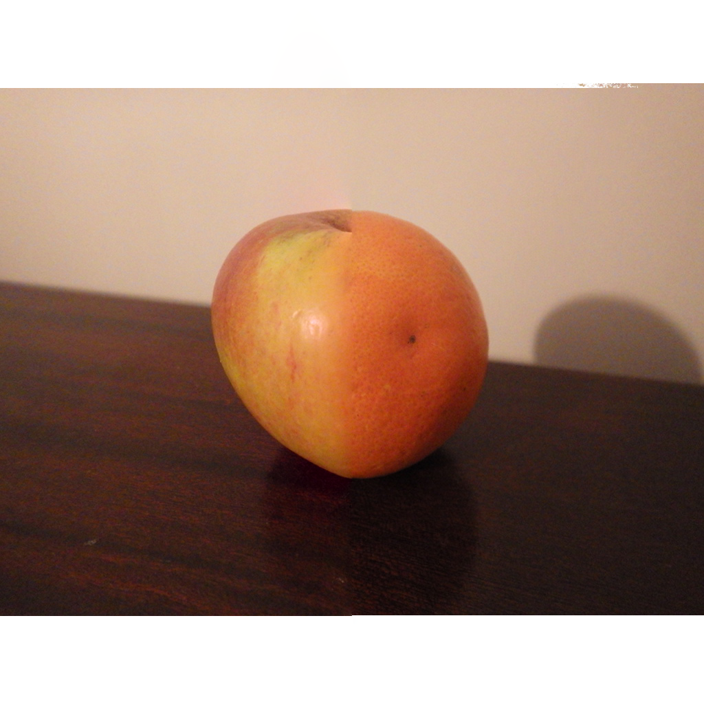
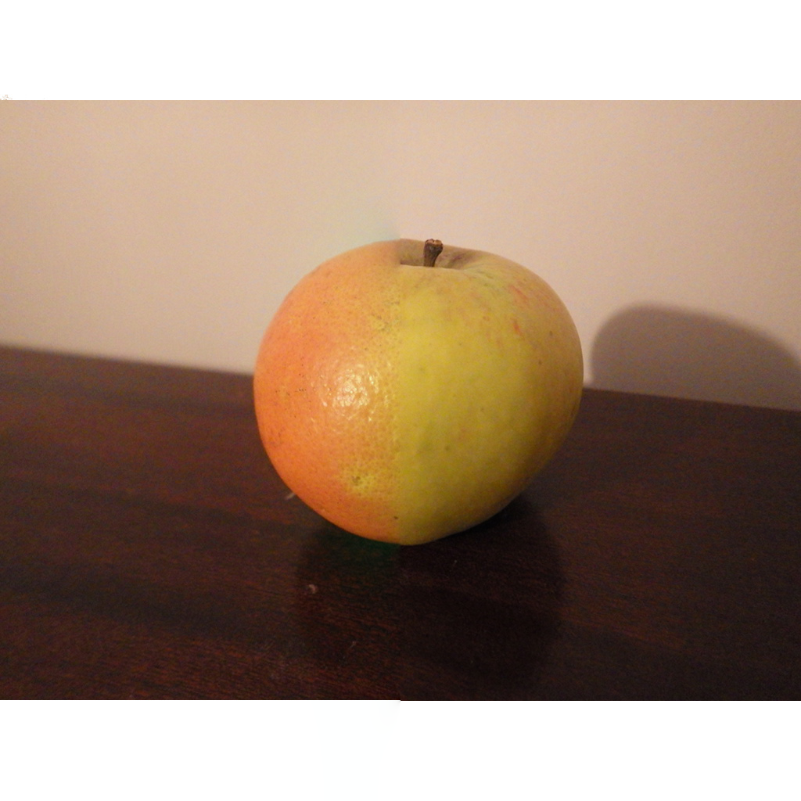

# 1. Synopsis

We will rely on multi-scale processing using pyramids to operates on an image represented at several sizes (scales):
  * Fine level
  * Coarse level

](https://upload.wikimedia.org/wikipedia/commons/thumb/4/43/Image_pyramid.svg/500px-Image_pyramid.svg.png)

We will deploy a technique called "pyramid blending" to merge two images together. Direct merging, i.e. without pyramid blending, produces a sharp edge where objects from the two images are merged:


I agree, not very nice :-( It is much nicer with pyramid blending, isn't it?


You'll write your code in three different files (four if you count `CMakeLists.txt`):

- `Pyramid.h`: Guess what? In this file we will write the declarations of the functions to:
    - Create a Gaussian pyramid from an image;
    - Create a Laplacian pyramid from a Gaussian pyramid;
    - Display a pyramid; and
    - Reconstruct an image from its Laplacian pyramid.
- `Pyramid.cxx`: we will write the definition of the functions.
- `Blending.cxx`: we will deploy the functions written in `Pyramid.cxx` in a program to blend the Laplacian pyramid of two images.

# 2. Preliminaries

1. Edit the `CMakeLists.txt` file from last time to add the new program:
```cmake
ADD_EXECUTABLE (Blending Pyramid.h Pyramid.cxx Blending.cxx)
TARGET_INCLUDE_DIRECTORIES (Blending PUBLIC ${OpenCV_INCLUDE_DIRS})
TARGET_LINK_LIBRARIES (Blending   ${OpenCV_LIBS})
```
2. Create three new files, `Pyramid.h`, `Pyramid.cxx` and `Blending.cxx`.
3. Download [orange.jpg](./orange.jpg). Save this image in the same directory as the `CMakeLists.txt` file.
4. Download [apple.jpg](./apple.jpg). Save this image in the same directory as the `CMakeLists.txt` file.
5. Edit the `CMakeLists.txt` file again, this time to copy the image in your binary directory:
```cmake
FILE (COPY "${CMAKE_CURRENT_SOURCE_DIR}/orange.jpg"
      DESTINATION "${CMAKE_CURRENT_BINARY_DIR}/")

FILE (COPY "${CMAKE_CURRENT_SOURCE_DIR}/apple.jpg"
      DESTINATION "${CMAKE_CURRENT_BINARY_DIR}/")
```
This way it will be easy for `Blending.cxx` to locate the input image files.

# 3. Have you done your homework?

This week we will reply on the knowledge learnt in the 2nd lecture of Semester 2, on *Multi-resolution images using Pyramids*. If you don't know what I am talking about, have a look at the slides now.

There are two main types of pyramids:

- Gaussian pyramid:
  

- Laplacian pyramid:
  


We will use both:

- We are going to merge the Laplacian pyramids of two images to create a new image.
- A Gaussian pyramid is needed to compute a Laplacian pyramid.

You are expected to study the code in the following Jupyter Notebook: [https://github.com/effepivi/ICP3038/blob/master/Lectures/9-Pyramids/notebooks/4-Image-stitching-with-pyramids-using-opencv.ipynb](https://nbviewer.jupyter.org/github/effepivi/ICP3038/blob/master/Lectures/9-Pyramids/notebooks/4-Image-stitching-with-pyramids-using-opencv.ipynb).
You must read both the text in English and the code.

# 4. The header file

Let's start with the beginning, the declarations in the header file.
Remember, put a preamble at the top of your files. ALL YOUR FILES. See here for a real example: [https://sourceforge.net/p/gvirtualxray/code/HEAD/tree/trunk/gvxr/include/gVirtualXRay/PolygonMesh.h](https://sourceforge.net/p/gvirtualxray/code/HEAD/tree/trunk/gvxr/include/gVirtualXRay/PolygonMesh.h). The preamble helps identify who wrote the file, when, and what the code does.

## In `Pyramid.h`

1. Add the `#ifndef/#define/#endif`. I always do that first when I create a header file (just because I don't want to forget).

```cpp
#ifndef __Pyramid_h
#define __Pyramid_h

// The declarations go here


#endif // __Pyramid_h
```

2. Add the preamble: which file? what for? when? who? anything missing/any bug?

```cpp
#ifndef __Pyramid_h
#define __Pyramid_h

/**
********************************************************************************
*
*   @file       PUT THE FILE NAME HERE
*
*   @brief      DESCRIBE WHAT THE FILE DOES IN ONE OR TWO LINES
*
*   @date       PUT THE DATE HERE
*
*   @author     PUT YOUR NAME HERE
*
*   @todo       PUT HERE ANYTHING THAT NEEDS DOING
*
********************************************************************************
*/


#endif // __Pyramid_h
```

3. Add the header files.

```cpp
#ifndef __Pyramid_h
#define __Pyramid_h

/**
********************************************************************************
*
*   @file       PUT THE FILE NAME HERE
*
*   @brief      DESCRIBE WHAT THE FILE DOES IN ONE OR TWO LINES
*
*   @date       PUT THE DATE HERE
*
*   @author     PUT YOUR NAME HERE
*
*   @todo       PUT HERE ANYTHING THAT NEEDS DOING
*
********************************************************************************
*/


//******************************************************************************
// Headers
//******************************************************************************
#include <vector>
#include <opencv2/opencv.hpp>


#endif // __Pyramid_h
```

4. Add the declarations.

Look again at the Jupyter notebook ([https://github.com/effepivi/ICP3038/blob/master/Lectures/9-Pyramids/notebooks/4-Image-stitching-with-pyramids-using-opencv.ipynb](https://nbviewer.jupyter.org/github/effepivi/ICP3038/blob/master/Lectures/9-Pyramids/notebooks/4-Image-stitching-with-pyramids-using-opencv.ipynb)) and identify all the functions. There are four or five.

```cpp
#ifndef __Pyramid_h
#define __Pyramid_h

/**
********************************************************************************
*
*   @file       PUT THE FILE NAME HERE
*
*   @brief      DESCRIBE WHAT THE FILE DOES IN ONE OR TWO LINES
*
*   @date       PUT THE DATE HERE
*
*   @author     PUT YOUR NAME HERE
*
*   @todo       PUT HERE ANYTHING THAT NEEDS DOING
*
********************************************************************************
*/


//******************************************************************************
// Headers
//******************************************************************************
#include <vector>
#include <opencv2/opencv.hpp>


//--------------------------------------------------------------------------
/// Create a Gaussian pyramid.
/**
 * @param anOriginalImage:    the image to process
 * @param aGaussianPyramid:   the Gaussian pyramid
 * @param aNumberOfLevels:    the number of levels in the pyramid
 */
//--------------------------------------------------------------------------
void createGaussianPyramid(const Mat& anOriginalImage,
                           vector<Mat>& aGaussianPyramid,
                           size_t aNumberOfLevels);


//--------------------------------------------------------------------------
/// Create an image to visualise a pyramid (Gaussian or Laplacian).
/**
 * @param aPyramid: the pyramid to visualise
 * @return  the visualisation of the pyramid
 */
//--------------------------------------------------------------------------
Mat displayPyramid(const std::vector<Mat>& aPyramid);


//--------------------------------------------------------------------------
/// Create a Laplacian pyramid from a Gaussian pyramid.
/**
 * @param aGaussianPyramid:   the Gaussian pyramid
 * @param aLaplacianPyramid:  the corresponding Laplacian pyramid
 */
//--------------------------------------------------------------------------
void createLaplacianPyramid(const vector<Mat>& aGaussianPyramid,
                            vector<Mat>& aLaplacianPyramid);


//--------------------------------------------------------------------------
/// Reconstruct an image from the Laplacian pyramid at a given level.
/**
 * @param aLaplacianPyramid:    the Laplacian pyramid
 * @param aLevel:    the level
 * @return the corresponding reconstructed image
 */
//--------------------------------------------------------------------------
Mat reconstruct(const vector<Mat>& aLaplacianPyramid, int aLevel);


#endif // __Pyramid_h
```


# 5. In `Pyramid.cxx`

1. Add the same preamble as what you have in `Pyramid.h` (just change the file name).
2. Include the header file (`Pyramid.h`).
3. Add the definitions. You can find the code in the Jupyter notebook ([https://github.com/effepivi/ICP3038/blob/master/Lectures/9-Pyramids/notebooks/4-Image-stitching-with-pyramids-using-opencv.ipynb](https://nbviewer.jupyter.org/github/effepivi/ICP3038/blob/master/Lectures/9-Pyramids/notebooks/4-Image-stitching-with-pyramids-using-opencv.ipynb)).

We will exploit this code in the image stitching. **You must make sure you understand it. You will need to demonstrate your understanding of the method in the report.**

# 6. The program

The image below shows the principle of image blending using Laplacian pyramids, with (a) Pyramid of the left-hand side image; (b) Pyramid of the right-hand side image; and (c) Combined pyramid.


In `Blending.cxx`:

1. Write your **preamble** to identify your file. Which file? what for? when? who? anything missing/any bug?
2. Include the **header files**.
  - See your code from the previous lab.
3. Add the **namespaces**.
  - See your code from the previous lab.
4. Add the **`main`** function.
5. Load the image file of the **orange**. Make sure you are using colours.
  - See `imread` in your code from the previous lab.
6. Check if the image **is loaded**
  - See your code from the previous lab.
7. Check if the image size is a **power of two**.
  - You must write your own function in `Pyramid.h`/`Pyramid.cxx`, e.g. `bool isPowerOfTwo(int i);``
  - It returns `true` if `i` is a power of two.
  - It returns `false` if `i` is not a power of two.
8. Repeat steps 5, 6 and 7 with the image file of the apple.
9. **Display** both images for testing purposes.
  - See `namedWindow`, `imshow`, and `waitKey` in your code from the previous lab.
10 Choose the **number of levels** in the pyramids, e.g. 6 levels (it'll be nice if this number could be inputted from the command line interface, either `argc`/`argv` or `cin`).
  - You may want to use `atoi`.
11. Compute the **Gaussian pyramid** of the orange.
  - You wrote the code in `Pyramid.h`/`Pyramid.cxx`.
12. Compute the **Gaussian pyramid** of the apple.
13. **Display** both Gaussian pyramids for testing purposes (you may want to save the corresponding images for your report).
14. Compute the **Laplacian pyramid** of the orange.
  - You wrote the code in `Pyramid.h`/`Pyramid.cxx`.
15. Compute the **Laplacian pyramid** of the apple.
16. **Display** both Laplacian pyramids for testing purposes (you may want to save the corresponding images for your report).
17. **For each level** of the Laplacian pyramids:
  - **Swap the two halves**.
  - You wrote the code in `Pyramid.h`/`Pyramid.cxx`.
18. Reconstruct the image from one of the new pyramids.
  - You wrote the code in `Pyramid.h`/`Pyramid.cxx`.
19. Reconstruct the image from the other new pyramid.
20. **Display** both reconstructed images for testing purposes.
21. **Save** both reconstructed images.
  - See `imwrite` in your code from the previous lab.

My code produces this two images:



