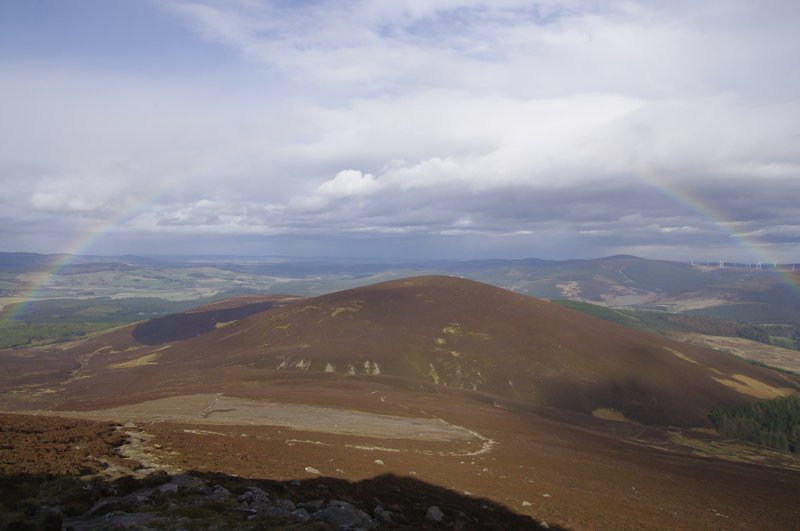

# 1. Synopsis

This lab relies on the 5th, 6th and 7th lectures of Semester 2:
5. Feature Detection
6. Feature Tracking
7. Transformations and panoramas

The technique you will use today:

1. Import left and right images;
2. For each image, detect keypoints;
3. For each keypoint, describe features;
4. Pairwise matching between the features of the left and right images;
5. Warping images (compute the projection matrix $R_{10}$).

You'll write your code in a single file (two if you count `CMakeLists.txt`):

- `panorama.cxx`.

# 2. Preliminaries

There are 2 sets of image files to test your code.

The first set has only two images [left-1.jpg](left-1.jpg) and [right-1.jpg](right-1.jpg):
- 
- 

The second set has three images [left-2.jpg](left-2.jpg), [middle-2.jpg](middle-2.jpg) and [right-2.jpg](right-2.jpg):
- 
- 
- 

You can of course use your own images. In fact you should always use your own data. It's more fun to see the results using your own images.

1. Edit the `CMakeLists.txt` file from last time to add the new program:

    ```cmake
    ADD_EXECUTABLE (panorama panorama.cxx)
    TARGET_INCLUDE_DIRECTORIES (panorama PUBLIC ${OpenCV_INCLUDE_DIRS} ${CMAKE_CURRENT_SOURCE_DIR}/include)
    TARGET_LINK_LIBRARIES (panorama   ${OpenCV_LIBS})
    ```

2. Create the new file, `panorama.cxx`.
3. Download the images I provided:
    - [left-1.jpg](left-1.jpg)
    - [right-1.jpg](right-1.jpg)
    - [left-2.jpg](left-2.jpg)
    - [middle-2.jpg](middle-2.jpg)
    - [right-2.jpg](right-2.jpg)
4. Move them in the same directory as `CMakeLists.txt`.
5. Edit the `CMakeLists.txt` file again, this time to copy the image in your binary directory:

    ```cmake
    FILE (COPY "${CMAKE_CURRENT_SOURCE_DIR}/left-1.jpg"
          DESTINATION "${CMAKE_CURRENT_BINARY_DIR}/")

    FILE (COPY "${CMAKE_CURRENT_SOURCE_DIR}/right-1.jpg"
          DESTINATION "${CMAKE_CURRENT_BINARY_DIR}/")

    FILE (COPY "${CMAKE_CURRENT_SOURCE_DIR}/left-2.jpg"
          DESTINATION "${CMAKE_CURRENT_BINARY_DIR}/")

    FILE (COPY "${CMAKE_CURRENT_SOURCE_DIR}/middle-2.jpg"
          DESTINATION "${CMAKE_CURRENT_BINARY_DIR}/")

    FILE (COPY "${CMAKE_CURRENT_SOURCE_DIR}/right-2.jpg"
          DESTINATION "${CMAKE_CURRENT_BINARY_DIR}/")
    ```

    This way it will be easy for `panorama.cxx` to locate the input video files.

# 3. Have you done your homework?

This week we will reply on the knowledge learnt in the 5th, 6th and 7th lectures of Semester 2. Make sure you are up-to-date with the lectures. There are slides, recording, and Jupyter notebooks. They'll help you understanding the lab. In particualr, you are expected to have studied the code in the following Jupyter Notebook:

- [https://github.com/effepivi/ICP3038/blob/master/Lectures/12-feature-detection/notebooks/1-detect-describe-match-using-ORB-in-opencv.ipynb](https://nbviewer.jupyter.org/github/effepivi/ICP3038/blob/master/Lectures/12-feature-detection/notebooks/1-detect-describe-match-using-ORB-in-opencv.ipynb).

You must **read and understand** both 1) the text in English and 2) the code.

# 4. Preamble

In  `panorama.cxx`, add the preamble to identify the file: which file? what for? when? who? anything missing/any bug?

```cpp
/**
********************************************************************************
*
*   @file       PUT THE FILE NAME HERE
*
*   @brief      DESCRIBE WHAT THE FILE DOES IN ONE OR TWO LINES
*
*   @date       PUT THE DATE HERE
*
*   @author     PUT YOUR NAME HERE
*
*   @todo       PUT HERE ANYTHING THAT NEEDS DOING
*
********************************************************************************
*/
```

# 5. Add the header files

I would use the usual suspects:

- `<iostream>` for printing out an error with `cerr` if there is an error;
- `<stdexcept>` for generating an exception with an error message;
- `<string>` maybe for the file names;
- `<opencv2/opencv.hpp>` for OpenCV's functions.

# 6. Add the `namespaces`

I personally use `std` and `cv`.

# 7. Add an empty `main` function

Make sure you take care of the command line with `(int argc, char** argv)`.

# 8. Compile

At this stage you have an empty program, I know, I know. However, I would still do it. The compilation is to test that `CMakeLists.txt` is working well and that I can start the fun part, coding.

# 9. Inputs/output

The program will load at least two images and generate a new image. The most elegant way to handle this is to use the command line arguments. I would use:
```bash
$ panorama left-1.jpg right-1.jpg panorama-1.jpg
$ panorama left-2.jpg middle-2.jpg right-2.jpg panorama-2.jpg
```
You can of course hard-code the filenames, but it is not as flexible as the command line.

# 10. Adapt the code from the Jupyter Notebook

Look at [Slide 41](https://blackboard.bangor.ac.uk/bbcswebdav/pid-3411334-dt-content-rid-10605129_1/courses/1542.202021/14-transformations_and_panoramas/ICP3038-Chapter_14-transformations_and_panoramas.html#(41)) of the 7th week of Semester 2. You can see that the main steps required to stitch images.
Steps 1. to 4. are already covered in the Jupyter notebook [https://github.com/effepivi/ICP3038/blob/master/Lectures/12-feature-detection/notebooks/1-detect-describe-match-using-ORB-in-opencv.ipynb](https://nbviewer.jupyter.org/github/effepivi/ICP3038/blob/master/Lectures/12-feature-detection/notebooks/1-detect-describe-match-using-ORB-in-opencv.ipynb). We'll use it as a starting point.


1. Import the left and right images (use `cv::imread`);
2. For each image, detect keypoints:
    - Create a feature detector, e.g. using the Oriented FAST and Rotated BRIEF (ORB) method:
    ```cpp
    Ptr<FeatureDetector> detector = ORB::create();
    ```
    - Detect the keypoints in `left_image` and `right_image`:
    ```cpp
    vector<KeyPoint> keypoints_left, keypoints_right;
    detector->detect(left_image, keypoints_left);
    detector->detect(right_image, keypoints_right);
    ```
3. For each keypoint, describe features:
    - Create a compatible feature extractor:
    ```cpp
    Ptr<DescriptorExtractor> extractor = ORB::create();
    ```
    - Create the feature vector for the keypoints.
    ```cpp
    Mat descriptors_left, descriptors_right;
    extractor->compute(left_image, keypoints_left, descriptors_left);
    extractor->compute(right_image, keypoints_right, descriptors_right);
    ```  
4. Pairwise matching between the features of the left and right images:
    - Match the keypoints in `left_image` and `right_image` by comparing their corresponding feature vectors. Here we use a brute-force algorithm and the L2-norm (also known as Euclidean norm or Euclidean distance).
    ```cpp
    BFMatcher matcher(NORM_L2);
    vector<DMatch> matches;
    matcher.match(descriptors_left, descriptors_right, matches);
    ```
    - Now the features have been matched, we need to filter the result. We want to limit the number of false-positives: Only small distances are valid. Create two variables to store the smallest and largest
    distance between two features of `matches`.
    ```cpp
    double max_distance = -numeric_limits<double>::max();
    double min_distance = numeric_limits<double>::max();
    ```
    You need to write a for loop to compute the min and max distances in `matches`. Accessing the distance between the features of the i-th match is easy, just use `matches[i].distance`.
    We will only consider matches whose distance is less than a given threshold, e.g. `mid_distance = min_distance + (max_distance - min_distance) / 2.0`. We must store these in a new STL vector as follows:
    ```cpp
    vector<DMatch> good_matches;

    for (int i = 0; i < matches.size(); i++ )
    {
        if (matches[i].distance < mid_distance)
        {
            good_matches.push_back(matches[i]);
        }
    }
    ```
5. Warping images (compute the projection matrix
  $$
  R_{10}
  $$
  ).


<!--


- Copy the two functions to your own program:
    - `Mat cleanBinaryImage(const Mat& aBinaryImage, int elementSize = 5)`, and
    - `Mat getForegroundMask(const Mat& aBackground, const Mat& aNewFrame, int aThreshold = 128)`,
- In the `main` function, you need most of the rest of the code:
    - Open the `VideoCapture`,
    - Create the windows (optional),
    - Create the `threshold` and the slider (called `trackbar` in OpenCV),
    - Declare the `background` variable,
    - Add the event loop,
    - Destroy the windows (optional), and
    - Release the VideoCapture (optional).
- Compile and run:
    - The program is using the webcam by default,
    - Press `B` to pick a background,
    - Press `ESC` or `Q` to quit.

**MacOS users:** Apple may deny you the right to use your own webcam. `VideoCapture video_input(0)` may even prevent the program from running. Have a look at this thread: [https://stackoverflow.com/questions/62190614/error-message-opencv-not-authorized-to-capture-video-status-0-in-macos-qt](https://stackoverflow.com/questions/62190614/error-message-opencv-not-authorized-to-capture-video-status-0-in-macos-qt). I haven't been able to replicate the problem as my versions of MacOS are too old. Don't worry, Step 10. below will fix that anyway.

# 10. Load the video from a file

The program needs to know:

1. the name of the input video file, and
2. the name of the output video file.

You must perform this action at the beginning of your `main` function. You have two options. The nice one and the ugly one:

- Use the arguments of the command line, or
- Hard code the file names,
    - it is not as elegant,
    - you'll need to re-compile when changing the file names, but then
    - the point of the lab is not parsing the command line arguments.

To open a video file, use the appropriate `VideoCapture` constructor. See [here](https://docs.opencv.org/3.4/d8/dfe/classcv_1_1VideoCapture.html#a949d90b766ba42a6a93fe23a67785951) for the documentation. For example, we can use

```cpp
VideoCapture video_input("one_moving_object.avi");
```

or

```cpp
VideoCapture video_input(argv[1]);
```

- Compile and run.
- You'll see that the video plays very quickly.
    - Once all the frames from the input video file are read, `video_input >> frame;` will produce an empty frame, which will end the event loop.
    - To loop through the video, replace:

    ```cpp
    video_input.release(); // We are now done with the camera, stop it
    throw runtime_error("OpenCV cannot grab a new frame from the camera, the program will terminate");
    ```

    with

    ```cpp
    video_input.set(CAP_PROP_POS_FRAMES, 0);
    ```

    It rewinds the video to the beginning of the video.

- Compile and run.

# 11. Save a video file

We saw how to do that in [https://github.com/effepivi/ICP3038/blob/master/Lectures/11-motion-tracking/notebooks/1-How_to_use_webcam_using_OpenCV.ipynb](https://nbviewer.jupyter.org/github/effepivi/ICP3038/blob/master/Lectures/11-motion-tracking/notebooks/1-How_to_use_webcam_using_OpenCV.ipynb). Before the event loop,

- You need a `VideoWriter` (see Step `[13]` of the notebook),
- For a `VideoWriter`, you need to know
    - the frame size (Step `[11]`)
    - the frame rate (Step `[12]`)
- To add a new image (called frame) in your output video, use `operator<<` (just like a `cout`),
    - see `video << frame;` in Step `[14]`.
    - We could save the detected foreground, e.g. `clean` in the event loop. Just use `video << clean;`.
- Compile, run, and check your new video with your favourite movie player, such as [VLC](https://www.videolan.org/).

# 12. Choose an appropriate background

- In all the videos I provided, there is no motion in the first few frames, i.e. we can use the first frame as the background.
- Before the event loop, use the first frame as the background.
- Don't forget how the frame was processed to produce the background:
  - RGB to greyscale;
  - blur;
  - UCHAR to float32.
- Don't forget to remove the `if (key == 'b')` statement in the event loop.

Now, compile and run the code. I get something like this:


If, like me, you are unhappy with the foreground mask (e.g. presence of holes or tiny islands), you can increase the size of your structuring element (mathematical morphology) and/or the size of your median filters.


Happier now! The foreground mask is perfect.

# 13. Locating moving objects

Moving objects, will be white in the `foreground_mask`.
We can easily find them using OpenCV's `findContours` function. See [here](https://docs.opencv.org/master/df/d0d/tutorial_find_contours.html) for the corresponding documentation.

- Use `findContours` to find the contours in `foreground_mask`.
- Use `drawContours` to draw the contours in `clean`.


See the red contours in the "Foreground" window above.

# 14. Ignoring "objects" that are too small


As we an see in the image above, some of the detected objects are far too small. We can compute the area (number of pixels). For each contour (i.e. detected objects), compute its area using `contourArea`. See [here](https://docs.opencv.org/master/d3/dc0/group__imgproc__shape.html#ga2c759ed9f497d4a618048a2f56dc97f1) for the documentation.
If the area is large enough, draw the contour, if not ignore it. To define how big "large enough" is, define your own threshold. You may adjust it by hand (hard coded), or with a slider.


As you can see above, the small objects are no longer highlighted.

# 15. Updating the background

**Bonus point:** After all, the first frame as the background may not have been so clever. Something started to move, and the static object from the first frame was detected as something that moved. To further improve your code, update the background so that static objects are not detected.

# 16. Compute the speed of the car

- **Bonus point:** Compute the speed (e.g. in pixels per frame) of each detected object.
- **Hint**: You must find the gravity centre of all the detected objects. For this purpose, you can use image moments. See [https://docs.opencv.org/master/d0/d49/tutorial_moments.html](https://docs.opencv.org/master/d0/d49/tutorial_moments.html) for a tutorial.

In particular,

- Finding the moments from the `contours`:

    ```cpp
    vector<Moments> mu(contours.size() );
    for( size_t i = 0; i < contours.size(); i++ )
    {
        mu[i] = moments( contours[i] );
    }
    ```

- Finding the gravity centre of the contour using its moments:

    ```cpp
    vector<Point2f> mc( contours.size() );
    for( size_t i = 0; i < contours.size(); i++ )
    {
        //add 1e-5 to avoid division by zero
        mc[i] = Point2f( static_cast<float>(mu[i].m10 / (mu[i].m00 + 1e-5)),
                         static_cast<float>(mu[i].m01 / (mu[i].m00 + 1e-5)) );
        cout << "mc[" << i << "]=" << mc[i] << endl;
    }
    ``` -->
