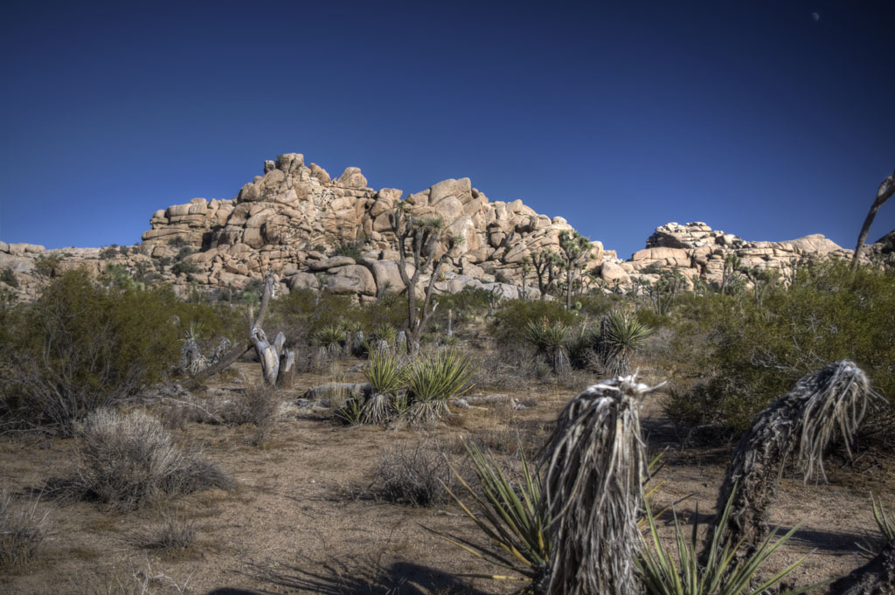
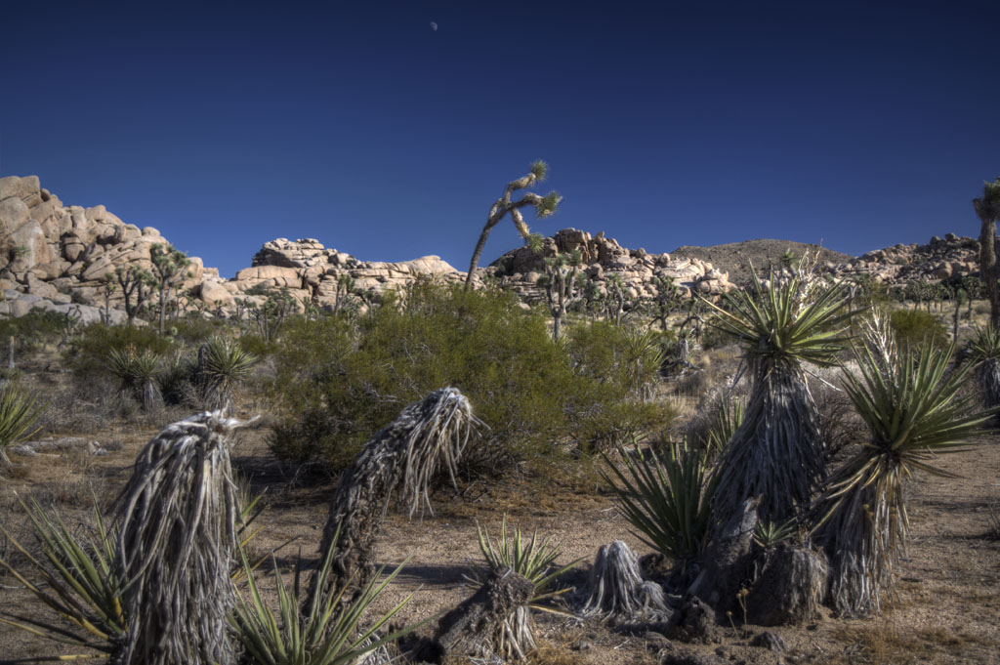

# 1. Synopsis

This lab relies on the 5th, 6th and 7th lectures of Semester 2:
5. Feature Detection
6. Feature Tracking
7. Transformations and panoramas

The technique you will use today:

1. Import left and right images;
2. For each image, detect keypoints;
3. For each keypoint, describe features;
4. Pairwise matching between the features of the left and right images;
5. Warping images (compute the projection matrix $R_{10}$).

You'll write your code in a single file (two if you count `CMakeLists.txt`):

- `panorama.cxx`.

# 2. Preliminaries

There are 2 sets of image files to test your code.

The first set has only two images [left-1.jpg](left-1.jpg) and [right-1.jpg](right-1.jpg):
- 
- 

The second set has three images [left-2.jpg](left-2.jpg), [middle-2.jpg](middle-2.jpg) and [right-2.jpg](right-2.jpg):
- 
- 
- 

You can of course use your own images. In fact you should always use your own data. It's more fun to see the results using your own images.

1. Edit the `CMakeLists.txt` file from last time to add the new program:

    ```cmake
    ADD_EXECUTABLE (panorama panorama.cxx)
    TARGET_INCLUDE_DIRECTORIES (panorama PUBLIC ${OpenCV_INCLUDE_DIRS} ${CMAKE_CURRENT_SOURCE_DIR}/include)
    TARGET_LINK_LIBRARIES (panorama   ${OpenCV_LIBS})
    ```

2. Create the new file, `panorama.cxx`.
3. Download the images I provided:
    - [left-1.jpg](left-1.jpg)
    - [right-1.jpg](right-1.jpg)
    - [left-2.jpg](left-2.jpg)
    - [middle-2.jpg](middle-2.jpg)
    - [right-2.jpg](right-2.jpg)
4. Move them in the same directory as `CMakeLists.txt`.
5. Edit the `CMakeLists.txt` file again, this time to copy the image in your binary directory:

    ```cmake
    FILE (COPY "${CMAKE_CURRENT_SOURCE_DIR}/left-1.jpg"
          DESTINATION "${CMAKE_CURRENT_BINARY_DIR}/")

    FILE (COPY "${CMAKE_CURRENT_SOURCE_DIR}/right-1.jpg"
          DESTINATION "${CMAKE_CURRENT_BINARY_DIR}/")

    FILE (COPY "${CMAKE_CURRENT_SOURCE_DIR}/left-2.jpg"
          DESTINATION "${CMAKE_CURRENT_BINARY_DIR}/")

    FILE (COPY "${CMAKE_CURRENT_SOURCE_DIR}/middle-2.jpg"
          DESTINATION "${CMAKE_CURRENT_BINARY_DIR}/")

    FILE (COPY "${CMAKE_CURRENT_SOURCE_DIR}/right-2.jpg"
          DESTINATION "${CMAKE_CURRENT_BINARY_DIR}/")
    ```

    This way it will be easy for `panorama.cxx` to locate the input video files.

# 3. Have you done your homework?

This week we will reply on the knowledge learnt in the 5th, 6th and 7th lectures of Semester 2. Make sure you are up-to-date with the lectures. There are slides, recording, and Jupyter notebooks. They'll help you understanding the lab. In particualr, you are expected to have studied the code in the following Jupyter Notebook:

- [https://github.com/effepivi/ICP3038/blob/master/Lectures/12-feature-detection/notebooks/1-detect-describe-match-using-ORB-in-opencv.ipynb](https://nbviewer.jupyter.org/github/effepivi/ICP3038/blob/master/Lectures/12-feature-detection/notebooks/1-detect-describe-match-using-ORB-in-opencv.ipynb).

You must **read and understand** both 1) the text in English and 2) the code.

# 4. Preamble

In  `panorama.cxx`, add the preamble to identify the file: which file? what for? when? who? anything missing/any bug?

```cpp
/**
********************************************************************************
*
*   @file       PUT THE FILE NAME HERE
*
*   @brief      DESCRIBE WHAT THE FILE DOES IN ONE OR TWO LINES
*
*   @date       PUT THE DATE HERE
*
*   @author     PUT YOUR NAME HERE
*
*   @todo       PUT HERE ANYTHING THAT NEEDS DOING
*
********************************************************************************
*/
```

# 5. Add the header files

I would use the usual suspects:

- `<iostream>` for printing out an error with `cerr` if there is an error;
- `<stdexcept>` for generating an exception with an error message;
- `<string>` maybe for the file names;
- `<opencv2/opencv.hpp>` for OpenCV's functions.

# 6. Add the `namespaces`

I personally use `std` and `cv`.

# 7. Add an empty `main` function

Make sure you take care of the command line with `(int argc, char** argv)`.

# 8. Compile

At this stage you have an empty program, I know, I know. However, I would still do it. The compilation is to test that `CMakeLists.txt` is working well and that I can start the fun part, coding.

# 9. Inputs/output

The program will load at least two images and generate a new image. The most elegant way to handle this is to use the command line arguments. I would use:
```bash
$ panorama left-1.jpg right-1.jpg panorama-1.jpg
$ panorama left-2.jpg middle-2.jpg right-2.jpg panorama-2.jpg
```
You can of course hard-code the filenames, but it is not as flexible as the command line.

# 10. Adapt the code from the Jupyter Notebook

Look at [Slide 41](https://blackboard.bangor.ac.uk/bbcswebdav/pid-3411334-dt-content-rid-10605129_1/courses/1542.202021/14-transformations_and_panoramas/ICP3038-Chapter_14-transformations_and_panoramas.html#(41)) of the 7th week of Semester 2. You can see that the main steps required to stitch images.
Steps 1. to 4. are already covered in the Jupyter notebook [https://github.com/effepivi/ICP3038/blob/master/Lectures/12-feature-detection/notebooks/1-detect-describe-match-using-ORB-in-opencv.ipynb](https://nbviewer.jupyter.org/github/effepivi/ICP3038/blob/master/Lectures/12-feature-detection/notebooks/1-detect-describe-match-using-ORB-in-opencv.ipynb). We'll use it as a starting point.

Note that I wrote a function to crop images. You'll need it:

```cpp
//------------------------------
Mat autoCrop(const Mat& anImage)
//------------------------------
{
    // Convert to grey scale
    Mat grey_image;
    cvtColor(anImage, grey_image, COLOR_BGR2GRAY);

    // Convert to binary
    Mat binary_image;
    threshold(grey_image, binary_image, 1, 255, THRESH_BINARY);

    // Find contours
    std::vector<std::vector<Point> > p_contour_set;
    std::vector<Vec4i> p_hierarchy_set;

#if CV_MAJOR_VERSION == 2 // OpenCV 2
	throw "Old OpenCV 2 is no longer supported"

#elif CV_MAJOR_VERSION == 3 // OpenCV 3
		findContours(binary_image, p_contour_set, p_hierarchy_set, CV_RETR_TREE, CV_CHAIN_APPROX_SIMPLE, Point(0, 0));

#else // OpenCV 4
		findContours(binary_image, p_contour_set, p_hierarchy_set, RETR_TREE, CHAIN_APPROX_SIMPLE, Point(0, 0));
#endif

    Rect bounding_rectangle(boundingRect(p_contour_set.front()));

    // Crop the input image using the bounding rectangle
    Mat output(anImage(bounding_rectangle));

    return output;
}
```

1. Import the left and right images (use `cv::imread`);
2. For each image, detect keypoints:
    - Create a feature detector, e.g. using the Oriented FAST and Rotated BRIEF (ORB) method:
    ```cpp
    Ptr<FeatureDetector> detector = ORB::create();
    ```
    - Detect the keypoints in `left_image` and `right_image`:
    ```cpp
    vector<KeyPoint> left_image_keypoints, right_image_keypoints;
    detector->detect(left_image, left_image_keypoints);
    detector->detect(right_image, right_image_keypoints);
    ```
3. For each keypoint, describe features:
    - Create a compatible feature extractor:
    ```cpp
    Ptr<DescriptorExtractor> extractor = ORB::create();
    ```
    - Create the feature vector for the keypoints.
    ```cpp
    Mat left_image_descriptors, right_image_descriptors;
    extractor->compute(left_image, left_image_keypoints, left_image_descriptors);
    extractor->compute(right_image, right_image_keypoints, right_image_descriptors);
    ```  
4. Pairwise matching between the features of the left and right images:
    - Match keypoints in `left_image` and `right_image` by comparing their corresponding feature vectors. Here we use a brute-force algorithm and the L2-norm (also known as Euclidean norm or Euclidean distance).
    ```cpp
    BFMatcher matcher(NORM_L2);
    vector<DMatch> matches;
    matcher.match(left_image_descriptors, right_image_descriptors, matches);
    ```
    - Now the features have been matched, we need to filter the result. We want to limit the number of false-positives: Only small distances are valid. Create two variables to store the smallest and largest distance between two features of `matches`.
    ```cpp
    double max_distance = -numeric_limits<double>::max();
    double min_distance = numeric_limits<double>::max();
    ```
    You need to write a for loop to compute the min and max distances in `matches`. Accessing the distance between the features of the i-th match is easy, just use `matches[i].distance`.
    ```cpp
    for (int i = 0; i < matches.size(); i++ )
    {
        double dist = matches[i].distance;
        if( dist < min_distance ) min_distance = dist;
        if( dist > max_distance ) max_distance = dist;
    }
    ```
    - We will only consider matches whose distance is less than a given threshold, e.g. `mid_distance = min_distance + (max_distance - min_distance) / 2.0`. We must store these in a new STL vector as follows:
    ```cpp
    vector<DMatch> good_matches;

    for (int i = 0; i < matches.size(); i++ )
    {
        if (matches[i].distance < mid_distance)
        {
            good_matches.push_back(matches[i]);
        }
    }
    ```
5. Warping images (compute the projection matrix ).
During this step, we need to compute the transformation matrix that will convert the 2D positions of the keypoints of one image into the same space as the ones of the other image.
    - First of all, we need to store the 2D positions of the keypoints for both images. We create two STL vectors of `Point2f`
(one per set of keypoints):
    ```cpp
    std::vector<cv::Point2f> left_image_point_set;
    std::vector<cv::Point2f> right_image_point_set;
    ```
    - Now we look at each good match in `good_matches` and add the corresponding 2D points to the corresponding vector:
    ```cpp
    // Look at each good match
    for (std::vector< cv::DMatch >::const_iterator ite =good_matches.begin();
         ite != good_matches.end();
         ++ite)
    {
        // Get the keypoints from the good match
        cv::KeyPoint left_image_keypoint(left_image_keypoints[ite->queryIdx]);
        cv::KeyPoint right_image_keypoint(right_image_keypoints[ite->trainIdx]);

        // Add the corresponding 2D points
        left_image_point_set.push_back(left_image_keypoint.pt);
        right_image_point_set.push_back(right_image_keypoint.pt);
    }
    ```
    - Now, we need to find the perspective transformation between two planes to transform the
    coordinates in `left_image_point_set` into the same plane as the coordinates in
    `right_image_point_set`. We use the RANdom SAmple Consensus (RANSAC) algorithm to do so:
    ```cpp
    Mat homography_matrix(findHomography(left_image_point_set, right_image_point_set, RANSAC));
    ```
    - Then we apply the new transformation matrix to deform the image, then we crop it:
    ```cpp
    // Then we apply the new transformation matrix to deform the right image:
    Mat transformed_right_image;
    warpPerspective(right_image, transformed_right_image, homography_matrix, Size(left_image.cols + right_image.cols, left_image.rows));
    // imshow("transformed_right_image", transformed_right_image);

    // Crop the image to its boundingbox
    transformed_right_image = autoCrop(transformed_right_image);
    // imshow("cropped_transformed_right_image", transformed_right_image);
    ```
    I used `imshow` for debugging purposes.
    - We create a new image where to store the panorama. It's the left image. We increase its size to stitch the right image:
    ```cpp
    Mat panorama_image;
    copyMakeBorder(left_image,
                   panorama_image,
                   0, 0, 0, transformed_right_image.cols,
                   BORDER_CONSTANT, 0);
    // imshow("padded left image", panorama_image);
    ```
    - Now we can copy the transformed image to the right of the left image
    ```cpp
    Mat right_ROI(panorama_image(Rect(left_image.cols,
                                 0,
                                 transformed_right_image.cols,
                                 transformed_right_image.rows)));
    transformed_right_image.copyTo(right_ROI);

    // imshow("right_ROI", right_ROI);
    // imshow("panorama", panorama_image);
    ```
6. Visualise and save the panorama. Job done!

- **Bonus point:** Make it possible to stitch together 3 or more images.
- **Hint**: 1) At the end of Step 5. `panorama_image` becomes `left_image`, 2) add a for loop to repeat Steps 1. to 5.
