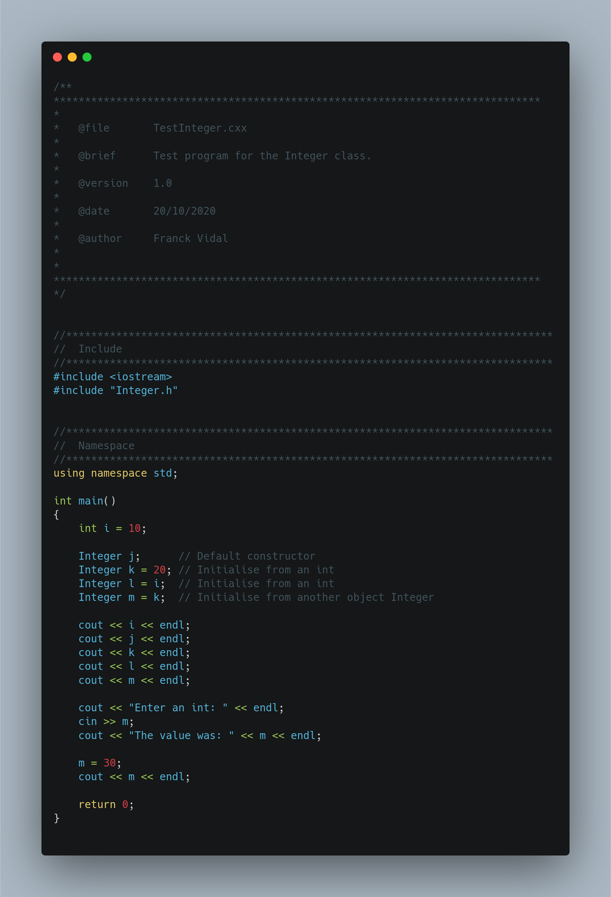
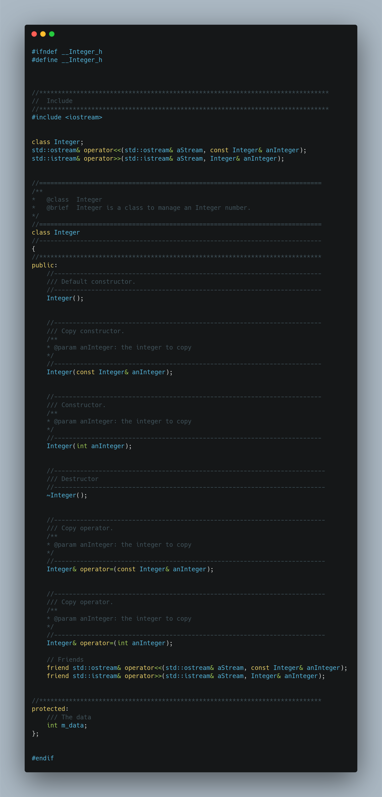
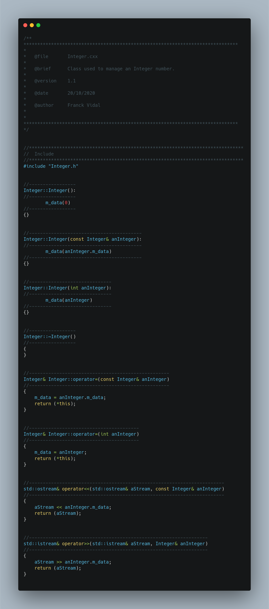

# Introduction

Last week, you wrote a program to convert temperatures from degrees Celsius to Fahrenheit. It made use of the command line to pass data to the program. Unit testing was used to check that

1. the program can run;
2. an error message is displayed when the command line is invalid;
3. the program outputs the right values when the command line is valid.

You also used C arrays. The aims of today's lab are:

1. Understand the constructor in C++ and using initialisation lists;
2. Get familiar with the implementation of (basic) classes;
3. Overwrite some operators (`=`, `<<` and `>>`);
4. Use `std::string` instead of `char*`.

Next week, we will use the STL library and write our own template class.


# Prerequisite

Make sure you completed the lab from last week as we are going to use unit testing to check our code again. It's good practice.


# Task 1: A simple class to hold an integer

For this task, you are given three C++ files:

1.  `include/Integer.h`, the header file defining a class to handle
    integer numbers;

2.  `src/Integer.cxx`, the source file that implements the code;

3.  `src/TestInteger.cxx`, a test program to try the class.

We want to adopt good C++ practice. There are plenty of tutorials,
forums, etc. on the Web that deal with how to write simple C++ classes.
I googled 'How to write a simple class in C++?'. The first item returned
from Google was:
[http://stackoverflow.com/questions/865922/how-to-write-a-simple-class-in-c](http://stackoverflow.com/questions/865922/how-to-write-a-simple-class-in-c)
The answers to the question on StackOverflow are mostly correct, but not
perfect. Most people did not use initialisation lists.

Initialisation lists have been around for a very long time, but many
people still ignore them despite their advantages. Initialisation lists
are used in constructors to set the initial values of class members in
an efficient manner. On the web, we may often see:

    DummyClass my_instance;
    my_instance = 10;

This is not very good. What will happen in practice?

1.  One call of the default constructor (`DummyClass::DummyClass()`);
2.  One call of the copy operator (`DummyClass::operator=(int)`). Note that the copy operator is also called assignment operator.

There are therefore two function calls to perform the declaration and the initialisation the
object instance. It is obviously not very good if we consider how many times we
may have to create objects in a large program. Instead, we should use:

    DummyClass my_instance(10);

or

    DummyClass my_instance = 10;

Both are equivalent and only the constructor
(`DummyClass::DummyClass(int)`) will be called. This is more effective
and it is better OOP practice.

We are going to declare a new class called *Integer* in `include/Integer.h`.

## Use of include guards

In `include/Integer.h`, add the include guards:

```cpp
#ifndef __Integer_h
#define __Integer_h


#endif // __Integer_h
```

then an empty class

```cpp
#ifndef __Integer_h
#define __Integer_h

class Integer
{

};

#endif // __Integer_h
```


## Encapsulation: Keep your private parts private

There are three types of encapsulation in C++:

- public: If a class member (attribute or method) is declared as *public*, then it can be accessed from anywhere.
- protected: If it is declared as *protected*, then it can be accessed only within the class itself and by inheriting classes.
- private: If it is declared as *private*, then it can only be accessed by the class that defines that member.

In this class, we only have one attribute called: `m_data` that will be used to store the data.
For safety reason, we make sure it is private. If anyone wants to access it, we'll provide special methods usually called getters and setters.

```cpp
#ifndef __Integer_h
#define __Integer_h

class Integer
{
private:
    m_data
};

#endif // __Integer_h
```

I always start a class with the attributes, then the constructors, then the destructor. There are 3 constructors we could provide:

- a default constructor that can instantiate a new object without the new of any parameter: `Integer()`;
- a copy constructor that can instantiate a new object from another object of the same type: `Integer(const Integer& aValue)`; and
- a constructor that can instantiate a new object from an `int`: `Integer(int aValue)`

These are public.


```cpp
#ifndef __Integer_h
#define __Integer_h

class Integer
{
public:
    Integer();
    Integer(const Integer& aValue);
    Integer(int aValue);

private:
    m_data
};

#endif // __Integer_h
```

## Add the header inclusion.

We will now modify `src/Integer.cxx` to implement the constructors.

```cpp
#include "Integer.h"
```

By convention, use `"` when including your own headers.

### Add the skeleton


```cpp
#include "Integer.h"

Integer::Integer()
{}


Integer::Integer(const Integer& aValue)
{}


Integer::Integer(int aValue)
{}
```

### Create the test program

In `TestInteger.cxx`, type:

```cpp
#include "Integer.h"

int main()
{
    int i = 10;

    Integer j;      // Default constructor
    Integer k = 20; // Initialise from an int
    Integer l = i;  // Initialise from an int
    Integer m = k;  // Initialise from another object Integer

    return 0;
}
```

### Add the new program in `CMakelists.txt`

```cmake
ADD_EXECUTABLE (TestInteger
    src/TestInteger.cxx
    include/Integer.h
    src/Integer.cxx)

TARGET_INCLUDE_DIRECTORIES (TestInteger PRIVATE include)
```

The last line tells CMake where to find the header files.

Now compile and test your code. Don't worry if it displays some rubbish.

## Initialisation lists

We will now modify `src/Integer.cxx` to actually implement the constructors.
We could write:

```cpp
#include "Integer.h"

Integer::Integer()
{
  m_data = 0;
}

Integer::Integer(const Integer& aValue)
{
  m_data = aValue.m_data;
}


Integer::Integer(int aValue)
{
  m_data = aValue;
}
```

It would work and many people do so on the Web. **BUT IT'S RUBBISH!!!** The good practice is to use an initialisation list. It's more effective. An initialisation list starts with `:`. It is followed by the attributes and their respective values between `()` , e.g.:

```cpp
#include "Integer.h"

Integer::Integer():
    m_data(0)
{}


Integer::Integer(const Integer& aValue):
    m_data(aValue.m_data)
{}


Integer::Integer(int aValue):
    m_data(aValue)
{}
```

## Destructor

The destructor is called when the instance is destroyed. It is declared as follows in `Integer.h`:

```cpp
~Integer();
```

Declare it right after the constructors.

In our case it does nothing.
Its definition in `Integer.cxx` is

```cpp
Integer::~Integer()
{}
```

As it does nothing we could have omitted it.

## `cout`/`cin`

Thanks to polymorphism, we can overwrite operators `>>` and `<<`

1. In the header file, include `iostream`.
2. Declare the operators in the header file before the class:

```cpp
class Integer;
std::ostream& operator<<(std::ostream& aStream, const Integer& aValue);
std::istream& operator>>(std::istream& aStream, Integer& aValue);
```

3. Change `private` into `protected`.
4. Just above `protected`, declare them as friends of the class:

```cpp
friend std::ostream& operator<<(std::ostream& aStream, const Integer& aValue);
friend std::istream& operator>>(std::istream& aStream, Integer& aValue);
```


5. Add the definition in `Integer.cxx`:

```cpp
std::ostream& operator<<(std::ostream& aStream, const Integer& aValue)
{
    aStream << aValue.m_data;
    return (aStream);
}


std::istream& operator>>(std::istream& aStream, Integer& aValue)
{
    aStream >> aValue.m_data;
    return (aStream);
}
```


6. Test them in `TestInteger.cxx`:

```cpp
#include <iostream>
#include "Integer.h"

using namespace std;

int main()
{
    int i = 10;

    Integer j;      // Default constructor
    Integer k = 20; // Initialise from an int
    Integer l = i;  // Initialise from an int
    Integer m = k;  // Initialise from another object Integer

    cout << i << endl;
    cout << j << endl;
    cout << k << endl;
    cout << l << endl;
    cout << m << endl;

    cout << "Enter an int: " << endl;
    cin >> m;
    cout << "The value was: " << m << endl;

    return 0;
}
```

## Assignment operator

In `TestInteger.cxx`, would it be nice to do:

```cpp
m = 30;
cout << m << endl;
```

add these instructions before the `return`.

My final file is as follows:



Compile your code. Oooops `Integer::operator=(int)` does not exist. Not a problem, let's add it to `Integer.h`:

```cpp
Integer& operator=(const Integer& aValue);
Integer& operator=(int aValue);
```

My final header file is as follows:




And in `Integer.cxx`:

```cpp
Integer& Integer::operator=(const Integer& aValue)
{
    m_data = aValue.m_data;

    return (*this);
}
```

Have a go at `Integer& operator=(int aValue)`. It's pretty similar.
Once done compile and test your code.

See `this`. It's a pointer on the instance. The `operator=` of an instance is returning itself.
This way, we could type something like:
```cpp
j = k = l = m = 0;
```

My final file is as follows:




# Task 2: Create your own class

You are going to write a new class called `StringInverter`. You need 3
extra files:

1.  `include/StringInverter.h`, the header file defining a class to
    handle integer numbers;
2.  `src/StringInverter.cxx`, the source file that implements the code;
3.  `src/TestStringInverter.cxx`, a test program to try the class.


## Add the new program in `CMakelists.txt`

First, modify CMakeLists.txt to add a new project. Just add:

```cmake
ADD_EXECUTABLE (TestStringInverter
    src/TestStringInverter.cxx
    include/StringInverter.h
    src/StringInverter.cxx)

TARGET_INCLUDE_DIRECTORIES (TestStringInverter PRIVATE include)
```

## Protected attribute

Now you can start implementing the class. It should contain:

```cpp
std::string m_data;
```

## Public methods

It should include the public
methods as follows:

```cpp
        StringInverter();
        StringInverter(const StringInverter& aString);
        StringInverter(const char* aString);
        StringInverter(const std::string& aString);

        StringInverter& operator=(const StringInverter& aString);
        StringInverter& operator=(const char* aString);
        StringInverter& operator=(const std::string& aString);

        const std::string& getInvertedString() const;

        bool operator==(const StringInverter& aString) const;
        bool operator==(const char* aString) const;
        bool operator==(const std::string& aString) const;

        bool operator!=(const StringInverter& aString) const;
        bool operator!=(const char* aString) const;
        bool operator!=(const std::string& aString) const;
```

Can you guess what they are doing? There is one method that stands out, `getInvertedString`. Look at `TestStringInverter.cxx`. We have:

```cpp
cout << my_string << ", once inverted, becomes " << my_string.getInvertedString() << "." << endl;
```

Running the program as follows:

```bash
$ ./TestStringInverter abcd
```

must output

```bash
abcd, once inverted, becomes dcba.
```

Don't implement all of the methods above in one go. Do **one** method at a time, **often** compile your code, **often** test your code, etc.

## Friend functions

You can also add friend functions `operator<<` and `operator>>`:

```cpp
    std::ostream& operator<<(std::ostream& aStream, const StringInverter& aString);
    std::istream& operator>>(std::istream& aStream, StringInverter& aString);
```
