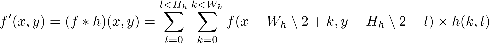
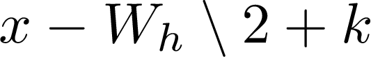
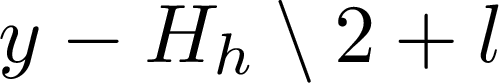

# Introduction

Last week we replaced the use of the LibJPEG with OpenCV. We also wrote a few programs:

1. Contrast enhancement,  
2. Negative,  
3. Blending of two images. This is the technique used to create a smooth and seamless transitions between two video sequences in films.     

This week, we will see how to

- Compare two images using he Root Mean Squared Error (RMSE) and the Zero mean Normalised-Cross Correlation (ZNCC or simply NCC).
- Filter images using the convolution.

# Root Mean Squared Error: RMSE

**Don't compare two floating point numbers together**
If you are not convinced, look at my video here.
If you are still not convinced, look at this guide: [https://floating-point-gui.de/errors/comparison/](https://floating-point-gui.de/errors/comparison/)

## Definition

For images, the Root Mean Squared Error (RMSE) and the Mean Absolute Error (MAE) are amongst the two most popular metrics used to compared images. There are widely used in statistics, computer vision, image analysis and machine learning. The RMSE between two images  and  is defined as:

<!-- =\sqrt{\frac{1}{w\times h}\sum_j\sum_i\left(I_1(i,j)-I_1(i,j)\right)^2}) -->


with  and  the number of pixels along the horizontal and vertical axes respectively.

The errors in RMSE are squared. It means that a much larger weight is assigned to larger errors: An error of 10, is 100 times worse than an error of 1.

Read more on [Wikipedia](https://en.wikipedia.org/wiki/Root-mean-square_deviation) if you want to know more on RMSE.

## Tasks

1. Add the declaration, e.g. `double getRMSE(const Image& anImage) const` in `Image.h`.
2. Add the definition in `Image.cxx`. `sqrt` is declared in `<cmath>`. There are several ways of implementing RMSE. Some students may use the operator`-` and add a new one point operator `square`. Some students may just use a `for` loop. Both solutions are perfectly valid as long as you:

1. Handle possible errors (e.g. if the images have different sizes, throw an error or return a large number, e.g.
FLT_MAX that is declared in the `<cfloat>` header file), and
2. Test your code. You may use unit testing to validate your function. You may use small test images, e.g.:

```cpp
Image I1({1, 1, 1, 1, 1, 1}, 2, 3);
// I1.getRMSE(I1); <-- must be close to 0
ASSERT_NEAR(I1.getRMSE(I1), 0.0, 1e-6);

// I1.getRMSE(I1 * 3); must be close to sqrt(1/6 * 6 * (1 - 3)^2), i.e. 2
ASSERT_NEAR(I1.getRMSE(I1 * 3), 2.0, 1e-6);

// I1.getRMSE(I1 * 9); must be close to sqrt(1/6 * 6 * (1 - 9)^2), i.e. 8
ASSERT_NEAR(I1.getRMSE(I1 * 9), 8.0, 1e-6);
```

# Zero mean Normalised-Cross Correlation: ZNCC

## Definition

The Zero Mean Normalised-Cross Correlation, also known as Pearson correlation coefficient, between two images  and  can be used to
measure how similar the images are. It is:

- +1 if they are fully correlated (i.e. they are extremely close to each other);
- 0 if they are fully uncorrelated (i.e. they are extremely different) (hint: if the images have different sizes, throw an error or return 0); and
- -1 if they are fully anticorrelated (i.e. one if the negative of the other one).

The ZNCC is defined as follows:


with

-  and  the number of pixels along the horizontal and vertical axes  respectively,
-  and  the average pixel values in  and  respectively, and
-  and  the standard deviations of the pixel values in  and  respectively.

Read more on [Wikipedia](https://en.wikipedia.org/wiki/Cross-correlation#Zero-normalized_cross-correlation_(ZNCC)) if you want to know more on ZNCC.

## Tasks

1. Add the declaration, e.g. `double getZNCC(const Image& anImage) const` in `Image.h`.
2. Add the definition in `Image.cxx`. In the previous lab, you must have implemented the accessors on `m_average_pixel_value` and `m_stddev_pixel_value`. You need to use them. Again, there are several ways of implementing ZNCC. Some students may use point operators. Some students may just use a `for` loop. Both solutions are perfectly valid as long as you:

1. Handle possible errors (e.g. if the images have different sizes, throw an error or return 0.0, and
2. Test your code. You may use unit testing to validate your function. You may use small test images, e.g.:

```cpp
Image I1({1, 2, 3, 4, 5, 6}, 2, 3);
Image I2(!I1); // Negative of I1
Image I3(0, 2, 3); // A black image

// Same image
// I1.getZNCC(I1); <-- must be close to 1
ASSERT_NEAR(I1.getZNCC(I1), 1.0, 1e-6);

// I1.getZNCC(10. + 4. * I1); <-- must be close to 1
ASSERT_NEAR(I1.getZNCC(10. + 4. * I1), 1.0, 1e-6);

// Negative image
// I1.getZNCC(I2); <-- must be close to -1
ASSERT_NEAR(I1.getZNCC(I2), -1.0, 1e-6);

// I1.getZNCC(10. + 4. * I2); <-- must be close to -1
ASSERT_NEAR(I1.getZNCC(10. + 4. * I2), -1.0, 1e-6);

// Different image
// I1.getZNCC(I3); <-- must be between -1 and 1
double value1 = I1.getZNCC(I3);
ASSERT_GT(value1, -1.0);
ASSERT_LT(value1, 1.0);

// I1.getZNCC(10. + 4. * I3); <-- must be between -1 and 1
double value2 = I1.getZNCC(10. + 4. * I3);
ASSERT_GT(value2, -1.0);
ASSERT_LT(value2, 1.0);
```

# Spatial filtering using a convolution

## Definition

For this method, we will use use a "kernel", also known as "sliding window" to filter an image.
The method performs a convolution between a kernel and an image. It is used for blurring, sharpening, embossing, edge detection, and more. This is probably the most used technique in image processing and image filtering.
It's discrete formula is:



-  is the input image, and  is the kernel (sliding window).
<!-- -   has a width of  and height of , -->
-   has a width of  and height of .
-  is the result of the convolution of  by 
-  the pixel index along the horizontal axis, and  the pixel index along the vertical axis.

## Tasks

1. Add the following declarations in `Image.h`:
  - `Image conv2d(const Image& aKernel) const;`
  - `Image gaussianFilter() const;`
  - `Image meanFilter() const;`
  - `Image averageFilter() const;`
  - `Image boxFilter() const;` and
  - `Image laplacianFilter() const`.
2. Add the following definitions in `Image.cxx`:

```cpp
//---------------------------------------------
Image Image::conv2d(const Image& aKernel) const
//---------------------------------------------
{
  // Initialise the output image so that it's black and it has the right size
  Image output_image(0.0, m_width, m_height);

  // Return the output
  return output_image;
}


//---------------------------------
Image Image::gaussianFilter() const
//---------------------------------
{
  // Create the kernel
  Image kernel(
    {
      1., 2., 1.,
      2., 4., 2.,
      1., 2., 1.
    }, 3, 3);

  // Normalise the kernel so that the sum of its coefficients is 1.
  kernel /= 16.0;

  // Filter the image
  return conv2d(kernel);
}


//-----------------------------
Image Image::meanFilter() const
//-----------------------------
{
  // Create the kernel
  Image kernel(
    {
      1., 1., 1.,
      1., 1., 1.,
      1., 1., 1.
    }, 3, 3);

  // Normalise the kernel so that the sum of its coefficients is 1.
  kernel /= 9.0;

  // Filter the image
  return conv2d(kernel);
}


//--------------------------------
Image Image::averageFilter() const
//--------------------------------
{
  return meanFilter();
}


//----------------------------
Image Image::boxFilter() const
//----------------------------
{
  return meanFilter();
}


//----------------------------------
Image Image::laplacianFilter() const
//----------------------------------
{
  // Create the kernel
  Image kernel(
    {
      1.,  1., 1.,
      1., -8., 1.,
      1.,  1., 1.
    }, 3, 3);

  // Filter the image
  return conv2d(kernel);
}
```

**MAKE SURE YOU COMPILE OFTEN. Write a bit of code, compile, write a bit of code, compile, and so on.**

3. You must choose how to deal with the border. A spatial convolution requires values from pixels outside of the image boundaries. There are various ways of dealing with the border. The three most popular methods are:

- **Extend:**
    The border pixels are extended as far as necessary to provide values for the convolution. It's easy to implement. If the pixel coordinates are not valid, use the coordinates of the closest pixel of the image:

    - If  is less than 0, use 0.
    - Else if  is equal to or greater than , use .
    - Else use 

    - If  is less than 0, use 0.
    - Else if  is equal to or greater than , use .
    - Else use 

- **zero padding:**
    The image is extended by adding extra zeros as necessary to provide values for the convolution. It is also easy to implement.
- **Crop:**
    Any pixel in the output image which would require values from beyond the edge is skipped. It results in the output image being slightly smaller than the input, with the edges having been cropped.

I recommend **Extend**.

4. Implement the formula:


You need four for loops:

```
for each image row
  for each image col

    Initialise the accumulator to zero

    for each kernel row
      for each kernel col

        Get the pixel position using the equation above
        Deal with the border if necessary

        Multiply the corresponding pixel value to the corresponding kernel element
        Add the result to the accumulator
      endfor
    endfor

    Set corresponding output image pixel to accumulator    
  endfor
endfor
```

Implement the pseudo code above in `Image Image::conv2d(const Image& aKernel) const`.

5. Add a new utility program, e.g. `gaussianFilter.cxx` with:

```cpp
#include <iostream>
#include <exception>
#include <string>

#include "Image.h"

using namespace std;

int main(int argc, char** argv)
{
    try
    {
        if argc == 3)
        {
            Image input(argv[1]);
            Image output(input.gaussianFilter());
            output.save(argv[2]);
        }
        else
        {
            string error_message = "Usage: " + argv[0] + " input_image output_image";
            throw error_message;
        }
    }
    catch (const exception& e)
    {
        cerr << "An error occured, see the message below." << endl;
        cerr << e.what() << endl;
        return 1;
    }
    catch (const string& e)
    {
        cerr << "An error occured, see the message below." << endl;
        cerr << e << endl;
        return 2;
    }
    catch (const char* e)
    {
        cerr << "An error occured, see the message below." << endl;
        cerr << e << endl;
        return 3;
    }

    return 0;
}
```

In CMakeLists.txt, you need:

```cmake
# Compilation
ADD_EXECUTABLE(gaussianFilter
    include/Image.h
    src/Image.cxx
    src/gaussianFilter.cxx)

# Add include directories
TARGET_INCLUDE_DIRECTORIES(gaussianFilter PUBLIC include)

IF(OpenCV_FOUND)
    target_include_directories(gaussianFilter PUBLIC ${OpenCV_INCLUDE_DIRS})
ENDIF(OpenCV_FOUND)

# Add linkage
target_link_libraries(gaussianFilter ${OpenCV_LIBS})
```

Make sure you compile often. You can test your code now to see if you can blur an image.

6. Write two new tools in:

  1. `boxFilter.cxx`
  2. `laplacianFilter.cxx`

to test the other filters.
