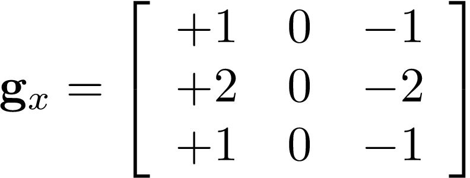
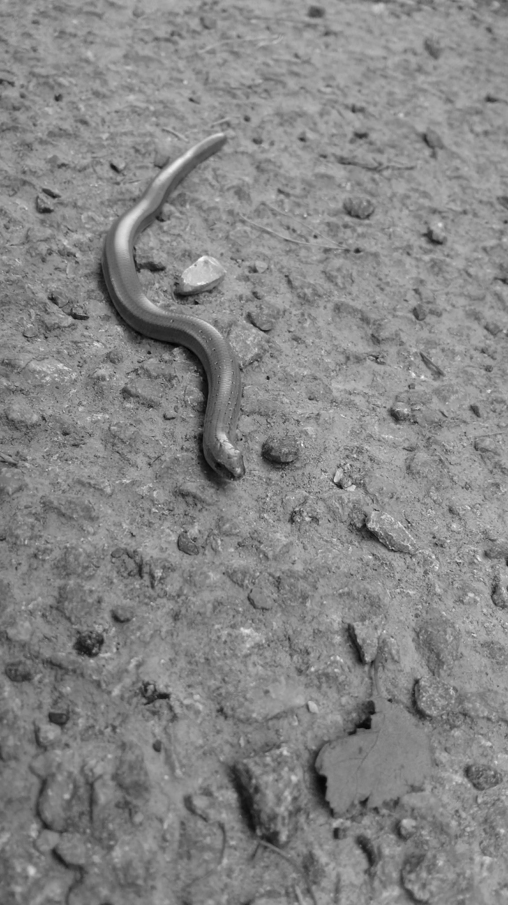
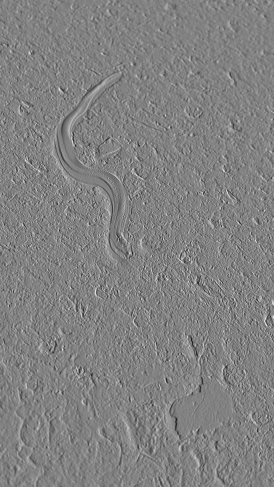
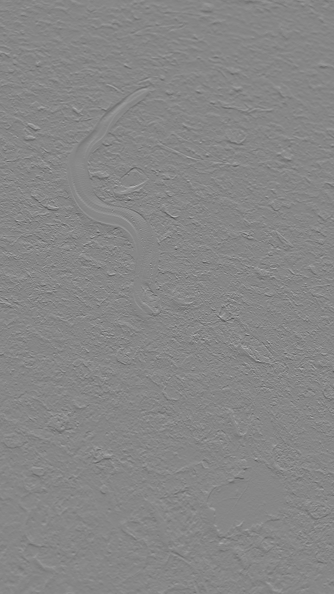

# Introduction

Last week we implemented the spatial convolution. We will use it this week. We will also use our point operators.

# Gradient magnitude using the Sobel operator

The Sobel operator makes use of two 3×3 convolution kernels  and .

<!-- mathbf{g}_x=\left[\begin{array}{ccc}+1&0&-1\\+2&0&-2\\+1&0&-1\\\end{array}\right]" alt="g_x Sobel kernel" /> -->

<!-- \mathbf{G}_y=\left[\begin{array}{ccc}+1&+2&+1\\0&0&0\\-1&-2&-1\\\end{array}\right]-->

The first one is used to compute an approximation of the vertical derivative (); the second to compute an approximation of the horizontal derivative ().
Consider the following images. **Img** is the input image.

| **Img** | Vertical derivative:  | Horizontal derivative:  |
|-------|-------|-------|
 |  ||

Convolutions using  and  produce output images with pixels values that are negative, null and positive.

| Image  | Mean    | Std dev | Min      | Max     |
|--------|---------|---------|----------|---------|
| **Img**| 135.511 | 25.599  | 5        | 253.667 |
|  | -0.160  | 38.756  | -659.333 | 432.000 |
|  | 0.078   | 41.165  | -580.667 | 520.000 |
