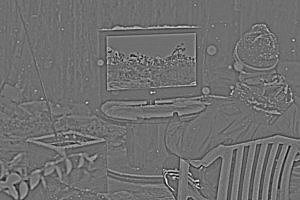
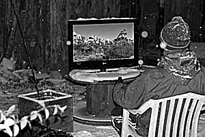

# Introduction

Last week we implemented the spatial convolution. We will use it this week. We will also use our point operators.

# Gradient magnitude using the Sobel operator

## Definition and examples

The Sobel operator makes use of two 3×3 convolution kernels  and .


<!-- mathbf{g}_x=\left[\begin{array}{ccc}+1&0&-1\\+2&0&-2\\+1&0&-1\\\end{array}\right]" alt="g_x Sobel kernel" /> -->


<!-- \mathbf{G}_y=\left[\begin{array}{ccc}+1&+2&+1\\0&0&0\\-1&-2&-1\\\end{array}\right]-->

The first one is used to compute an approximation of the vertical derivative (); the second to compute an approximation of the horizontal derivative ().
Consider the following images.

|  Input:  | Vertical derivative:  | Horizontal derivative:  |
|-------|-------|-------|
 |  ||

Convolutions using  and  produce output images with pixels values that are negative, null and positive.

| Image  | Mean    | Std dev | Min      | Max     |
|--------|---------|---------|----------|---------|
| **Img**| 135.511 | 25.599  | 5        | 253.667 |
|  | -0.160  | 38.756  | -659.333 | 432.000 |
|  | 0.078   | 41.165  | -580.667 | 520.000 |

There are two ways to compute the gradient magnitude from  and :

1. A fast approximation: 
<!--  -->

2. A slower, but more accurate, calculation: 
<!--  -->

Both methods are equally fine. Choose one.
If you choose 1., well maybe you want to add a new point operator `Image Image::abs() const` (hint, hint).
If you choose 2., maybe you want to add two new point operators `Image Image::square() const` and `Image Image::sqrt() const`.
The table below shows the statistics for the different images.

| Image  | Mean    | Std dev | Min      | Max     |
|--------|---------|---------|----------|---------|
| **Img**| 135.511 | 25.599  | 5        | 253.667 |
|  | -0.160  | 38.756  | -659.333 | 432.000 |
|  | 0.078   | 41.165  | -580.667 | 520.000 |
|  | 27.056 | 31.024 |0 |580.667 |
|  | 25.560 | 29.132 | 0 | 659.333 |
|  +  | 52.617 | 49.340 | 0 | 848.667 |
|  | 1694.552 | 5247.248 | 0 | 337173.812 |
|  | 1502.017 | 4540.478 | 0 | 434720.500 |
|  |  41.438 | 38.464 | 0 | 659.527 |


|  Input:  |  |  | +  |
|-------|-------|-------|-------|
 |  | ||


|  Input:  |  |  | |
|-------|-------|-------|-------|
 |  | ||


**As you can see, even if the dynamic range of the input image is withn the [0,255] range, the output images are not.** In other words, before saving the data in an image file format such as JPEG, make sure to normalise the image. For an ASCII file, do not normalise the image. You may wish to use the code below:

```cpp
std::string output_filename = argv[2];
std::string capital_filename;

// Capitalise
for (int i = 0; i < temp_filename.size(); ++i)
    capital_filename += std::toupper(temp_filename[i]);

if (std::string(aFilename).size() > 4)
{
    // Save an ASCII image file: Do not normalise
    if(capital_filename.substr( capital_filename.length() - 4 ) == ".TXT")
    {
        output.save(output_filename);
    }
    // Save the data using an image file format: Normalise
    else
    {
        (output.normalise() * 255).save(output_filename);
    }
}
```

## Tasks

1. Add new point operators in `Image.h` and `Image.cxx`:
    - `Image Image::abs() const`
    - `Image Image::square() const`
    - `Image Image::sqrt() const`
2. Add a new method in `Image.h` and `Image.cxx`:
    - `Image Image::gradientMagnitude() const`
3. Add a new program `gradientMagnitude.cxx` (similar to `guassianFilter` from [Lab 8](../Lab-08-Image-comparison_and_convolution)) to use your new `gradientMagnitude` method.


```cpp
#include <iostream>
#include <exception>
#include <string>

#include "Image.h"

using namespace std;

int main(int argc, char** argv)
{
    try
    {
        if (argc == 3 || argc == 4)
        {
            Image input(argv[1]);
            Image output(input.gradientMagnitude());

            // Save the image
            std::string output_filename = argv[2];
            std::string capital_filename;

            // Capitalise
            for (int i = 0; i < temp_filename.size(); ++i)
                capital_filename += std::toupper(temp_filename[i]);

            // There are enough characters for a file extension
            if (std::string(aFilename).size() > 4)
            {
                // Save an ASCII image file: Do not normalise
                if(capital_filename.substr( capital_filename.length() - 4 ) == ".TXT")
                {
                    output.save(output_filename);
                }
                // Save the data using an image file format: Normalise
                else
                {
                    (output.normalise() * 255).save(output_filename);
                }
            }

            // Display the image
            if (argc == 4)
            {
                output.display();
            }
        }
        else
        {
            string error_message = "Usage: " + argv[0] + " input_image output_image";
            throw error_message;
        }
    }
    catch (const exception& e)
    {
        cerr << "An error occured, see the message below." << endl;
        cerr << e.what() << endl;
        return 1;
    }
    catch (const string& e)
    {
        cerr << "An error occured, see the message below." << endl;
        cerr << e << endl;
        return 2;
    }
    catch (const char* e)
    {
        cerr << "An error occured, see the message below." << endl;
        cerr << e << endl;
        return 3;
    }

    return 0;
}
```

In `CMakeLists.txt`, you need:

```cmake
# Compilation
ADD_EXECUTABLE(gradientMagnitude
    include/Image.h
    src/Image.cxx
    src/gradientMagnitude.cxx)

# Add include directories
TARGET_INCLUDE_DIRECTORIES(gradientMagnitude PUBLIC include)

IF(OpenCV_FOUND)
    target_include_directories(gradientMagnitude PUBLIC ${OpenCV_INCLUDE_DIRS})
ENDIF(OpenCV_FOUND)

# Add linkage
target_link_libraries(gradientMagnitude ${OpenCV_LIBS})
```


# Sharpening

Have a look at Slides 53-54 of Week 8 on Blackboard. It's what we are going to implement.

Original - Gaussian blur (5x5) = Details

Original +  = Sharpen

**DO NOT NORMALISE THE FINAL IMAGE!** Instead you need to clamp the pixel values to preserve the same dynamic range as the input image. See below.

## Example with 

 -  = 

 +   = 


## Tasks

### sharpen method

1. Add the declaration of `Image sharpen(double alpha)` in `Image.h`.
2. Add the definition of `Image Image::sharpen(double alpha)` in `Image.cxx`:
    - You first need to create a 5x5 gaussian kernel:
    ```cpp
        Image gaussian_5x5_kernel(
            {
                1.,  4.,  7.,  4., 1.,
                4., 16., 26., 16., 4.,
                7., 26., 41., 26., 7.,
                4., 16., 26., 16., 4.,
                1.,  4.,  7.,  4., 1.
            }, 5, 5);
        gaussian_5x5_kernel /= 273.;
    ```

    - Then create an image of the details:
    ```cpp
        Image blur = conv2d(gaussian_5x5_kernel);
        Image details = *this - blur;
    ```

    - Add the details to the original:
    ```cpp
    Image output = *this + alpha * details;
    ```

    - Make sure to preserve the dynamic range:
    ```cpp
    return output.clamp(getMinValue(), getMaxValue());
    ```
3.  Add the declaration of `Image clamp(float aLowerThreshol, float anUpperThreshold) const` in `Image.h`.
4. Add the definition of `Image Image::clamp(float aLowerThreshold, float anUpperThreshold) const` in `Image.cxx` to implement:


with  = `*this` and  the image returned by the `clamp` method.


### Executable

Add a new program `sharpen` in `sharpen.cxx`. Its command line is:

- `argc[0]`: the executable
- `argc[1]`: the input file
- `argc[2]`: the output file
- `argc[3]`: alpha (default=1) (optional)
- `argc[4]`: -display (optional)

The code is as follows:

```cpp
#include <iostream>
#include <exception>
#include <string>

#include "Image.h"

using namespace std;


void onTrackbar( int, void* )


Image g_input;
Image g_output;
double g_alpha = 1.0;

const int g_alpha_slider_int_max    = 100;
const double g_alpha_slider_double_max = 10;
int g_alpha_slider = 1;


//-----------------------------
int main(int argc, char** argv)
//-----------------------------
{
    try
    {

        if (argc == 3 || argc == 4|| argc == 5)
        {
            // Load the input image
            g_input = argv[1];

            // Retrieve alpha
            string argv_3 = argv[3];
            if (argc >= 4)
            {
                if (argv_3 != "-display")
                {
                    g_alpha = stof(argv_3);
                }
            }

            // Filter the image
            g_output = g_input.sharpen(g_alpha);

            // Display the image
            if (argv_3 == "-display || argc == 5)
            {
              cv::namedWindow("Sharpening", cv::WINDOW_AUTOSIZE); // Create Window
              cv::createTrackbar( "Alpha", "Sharpening", &g_alpha_slider, g_alpha_slider_int_max, on_trackbar );

              onTrackbar( g_alpha_slider, 0 );            }

            // Save the output
            output.save(argv[2]);
        }
        else
        {
            string error_message = "Usage: " + argv[0] + " input_image output_image [alpha] [-display]";
            throw error_message;
        }
    }
    catch (const exception& e)
    {
        cerr << "An error occured, see the message below." << endl;
        cerr << e.what() << endl;
        return 1;
    }
    catch (const string& e)
    {
        cerr << "An error occured, see the message below." << endl;
        cerr << e << endl;
        return 2;
    }
    catch (const char* e)
    {
        cerr << "An error occured, see the message below." << endl;
        cerr << e << endl;
        return 3;
    }

    return 0;
}


//---------------------------
void onTrackbar( int, void* )
//---------------------------
{
    // Compute the value of alpha from the slider
    g_alpha = g_alpha_slider_double_max * g_alpha_slider / g_alpha_slider_int_max;

    // Sharpen
    g_output = g_input.sharpen(g_alpha)

    // Normalise for floating-point numbers
    Image display_image = g_output / 255.0;

    // Convert the data into an OpenCV Mat instance.
    cv::Mat cv_image(display_image.getHeight(), display_image.getWidth(), CV_32FC1, (float*) display_image.getPixelPointer());

    // Display the image
    cv::imshow("Sharpening", cv_image);
}
```

In `CMakeLists.txt`, you need:

```cmake
# Compilation
ADD_EXECUTABLE(sharpen
    include/Image.h
    src/Image.cxx
    src/sharpen.cxx)

# Add include directories
TARGET_INCLUDE_DIRECTORIES(sharpen PUBLIC include)

IF(OpenCV_FOUND)
    target_include_directories(sharpen PUBLIC ${OpenCV_INCLUDE_DIRS})
ENDIF(OpenCV_FOUND)

# Add linkage
target_link_libraries(sharpen ${OpenCV_LIBS})
```
