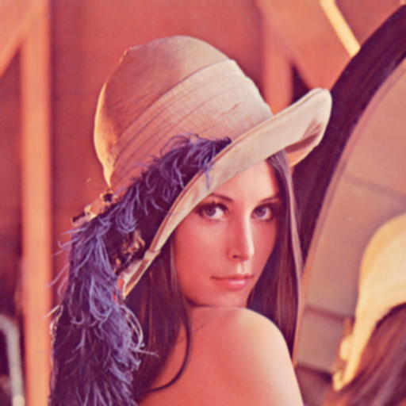
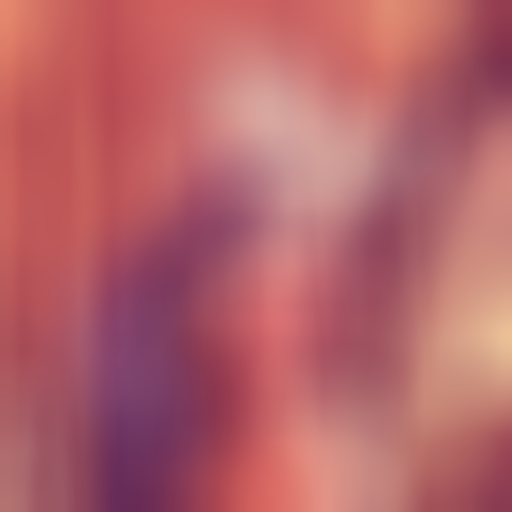

# Aim and objectives

The aim of today's lab is to become familiar with OpenCV and its usage in C/C++. To achieve this, we will fulfil the objectives as follows:

1. Create an OpenCV project using CMake;
2. Display an image using OpenCV;
3. Convert from RGB to luminance;
4. Convert from `unsigned char` to `float`;
5. Save an image into a file;
6. Add a constant to the pixels of an image;
7. Apply a log transform to the pixels of an image; ahd
8. Apply some basic filtering techniques.

To achieve these goals, we will create several programs:

1. `displayImage.cxx`: A simple program using OpenCV to open an image
    and display it in a window;
2. `rgb2grey.cxx`: A program to convert a RGB image in a greyscale
    image using OpenCV;
3. `logScale.cxx`: A program to display an image in the log scale;
4. `meanFilter.cxx`: A program to perform the mean filter using OpenCV;
5. `medianFilter.cxx`: A program to perform the median filter using
    OpenCV;
6. `gaussianFilter.cxx`: A program to perform the Gaussian filter using
    OpenCV.

Note that this semester I am not going to provide any test image. I expect that you test your code using your own data.

# Learning outcomes

1. Use CMake to generate a project that makes use of OpenCV;
2. Load an image using OpenCV;
3. Display an image using OpenCV;
4. Convert a RGB image into a greyscale image;
5. Convert an image stored in UINT8 into float32;
6. Add a constant to an image;
7. Apply a log transform to an image;
8. Filter an image using a box filter;
9. Filter an image using a median filter; and
10. Filter an image using a Gaussian filter.

# Table of Contents

- [Task 1: Files](#task-1-files)
- [Task 2: Prepare `CMakeLists.txt`](#task-2-prepare-cmakeliststxt)
- [Task 3: Configure and generate the project](#task-3-configure-and-generate-the-project)
- [Task 4: Opening and Displaying an Image](#task-4-opening-and-displaying-an-image)
- [Task 5: Converts a RGB Image in a Greyscale Image](#task-5-converts-a-rgb-image-in-a-greyscale-image)
- [Task 6: Display an Image in the Log Scale](#task-6-display-an-image-in-the-log-scale)
- [Task 7: Mean Filter](#task-7-mean-filter)
- [Task 8: Median Filter](#tasks-8-and-9-median-and-gaussian-filters)
- [Task 9: Gaussian Filter](#tasks-8-and-9-median-and-gaussian-filters)

# Installing OpenCV

We installed OpenCV in Semester 1. See [Lab 7 on Blending and Segmentation(../Lab-07-Blending-segmentation). I recommend OpenCV 4.5.x.

<!-- Before using OpenCV, you have to make sure it is installed on the
machine you are using. **If it is a University's PC, we will consider
that it is installed (so skip this section).**

-   On Mac, OpenCV is available via Homebrew (`brew install opencv3`),
    Fink and Macports;

-   Most Linux distributions have packages for OpenCV. Make sure you
    install the `-devel` package;

-   There are pre-compiled versions on <http://www.opencv.org/> that can
    be used on Windows.

    1.  **Go to OpenCV's website** at <http://www.opencv.org/>.

    2.  **Download the latest version of OpenCV 3** (i.e. 3.4.5): On the
        top (see Figure [1](#fig:main_page){reference-type="ref"
        reference="fig:main_page"}), there is a link called 'RELEASES',
        or just click on
        <https://sourceforge.net/projects/opencvlibrary/files/3.4.5/opencv-3.4.5-vc14_vc15.exe/download>.

        ![[\[fig:main_page\]]{#fig:main_page
        label="fig:main_page"}OpenCV's
        website.](opencv_mainpage.png){#fig:main_page
        width="\\textwidth"}

    3.  **Run the file** and extract the library in `C:` drive.

    4.  **Job done:** There is a new directory called `opencv` in the
        `C:` drive. -->

# Task 1: Files

1. Create the following empty files in the root directory of your project:

- `displayImage.cxx`;
- `rgb2grey.cxx`;
- `logScale.cxx`;
- `meanFilter.cxx`;
- `medianFilter.cxx`;
- `gaussianFilter.cxx`; and
- `CMakeLists.txt`.

2. If you are using MS Windows, double-check the file extension;

- Open the `File Explorer`; if you do not have an icon for this in the task bar; click `Start`, click `Windows System`, and then `File Explorer`.
- Click the `View` tab in `File Explorer`.
- Click the box next to `File name extensions` to see file extensions.

Last semester some people had problems as they did not see that the file extension was actually `.txt` rather than `.cxx`.

3. Make sure every file `.cxx` is compilable. For example we could add:

```cpp
int main(int argc, char** argv)
{
    return 0;
}
```

# Task 2: Prepare `CMakeLists.txt`

As some of you will use

-   MS Windows on the University's computers,
-   MS Windows on their own computer(s),
-   Mac OS, and
-   Linux

it is important to keep in mind portability and we saw that toolchains
can help us achieve it. [CMake](https://www.cmake.org/) is an example of toolchain that is user friendly. It is actually the industry standard. I assume it is still installed on your PC.

1. Edit `CMakeLists.txt`.


2. Set the minimum CMake version to at least 3.1. It is needed to enable  the C++ 11 standard.
```cmake
CMAKE_MINIMUM_REQUIRED(VERSION 3.1)
PROJECT(ICP3038--Lab10--Intro2OpenCV)
```

3. C++ 11 is a requirement for OpenCV 4, enable it with:

```cmake
set (CMAKE_CXX_STANDARD 11)
set(CMAKE_CXX_STANDARD_REQUIRED ON)
set(CMAKE_CXX_EXTENSIONS OFF)
```

4. For MS Windows users, add where OpenCV might be installed (look in D: first, then in C:). If you installed OpenCV somewhere else, adjust the path accordingly:

```cmake
IF (WIN32)
    SET (CMAKE_PREFIX_PATH ${CMAKE_PREFIX_PATH} "D:\\opencv\\build")
    SET (CMAKE_PREFIX_PATH ${CMAKE_PREFIX_PATH} "C:\\opencv\\build")
ENDIF (WIN32)
```

5. Find OpenCV
```cmake
FIND_PACKAGE(OpenCV REQUIRED)
```

6. The executable programs
```cmake
ADD_EXECUTABLE (displayImage   displayImage.cxx)
ADD_EXECUTABLE (rgb2grey       rgb2grey.cxx)
ADD_EXECUTABLE (logScale       logScale.cxx)
ADD_EXECUTABLE (meanFilter     meanFilter.cxx)
ADD_EXECUTABLE (medianFilter   medianFilter.cxx)
ADD_EXECUTABLE (gaussianFilter gaussianFilter.cxx)
```

7. Add OpenCV's header path for each program
```cmake
INCLUDE_DIRECTORIES (${OpenCV_INCLUDE_DIRS})
TARGET_INCLUDE_DIRECTORIES(displayImage PUBLIC ${OpenCV_INCLUDE_DIRS})
TARGET_INCLUDE_DIRECTORIES(rgb2grey PUBLIC ${OpenCV_INCLUDE_DIRS})
TARGET_INCLUDE_DIRECTORIES(logScale PUBLIC ${OpenCV_INCLUDE_DIRS})
TARGET_INCLUDE_DIRECTORIES(meanFilter PUBLIC ${OpenCV_INCLUDE_DIRS})
TARGET_INCLUDE_DIRECTORIES(medianFilter PUBLIC ${OpenCV_INCLUDE_DIRS})
TARGET_INCLUDE_DIRECTORIES(gaussianFilter PUBLIC ${OpenCV_INCLUDE_DIRS})
```

8. Add OpenCV libraries to each executable programs
```cmake
TARGET_LINK_LIBRARIES (displayImage   ${OpenCV_LIBS})
TARGET_LINK_LIBRARIES (rgb2grey       ${OpenCV_LIBS})
TARGET_LINK_LIBRARIES (logScale       ${OpenCV_LIBS})
TARGET_LINK_LIBRARIES (meanFilter     ${OpenCV_LIBS})
TARGET_LINK_LIBRARIES (medianFilter   ${OpenCV_LIBS})
TARGET_LINK_LIBRARIES (gaussianFilter ${OpenCV_LIBS})
```

9. If windows is used, copy the DLLs into the project directory
```cmake
SET (CV_VERSION_STRING ${OpenCV_VERSION_MAJOR}${OpenCV_VERSION_MINOR}${OpenCV_VERSION_PATCH})
IF (WIN32)
    IF ( ${OpenCV_VERSION_MAJOR} EQUAL 4)
        IF (EXISTS "${OpenCV_DIR}/x64/vc15/bin/opencv_videoio_ffmpeg${CV_VERSION_STRING}_64.dll")
            FILE (COPY        "${OpenCV_DIR}/x64/vc15/bin/opencv_videoio_ffmpeg${CV_VERSION_STRING}_64.dll"
                  DESTINATION "${CMAKE_CURRENT_BINARY_DIR}/")
        ELSE ()
      MESSAGE (WARNING "opencv_videoio_ffmpeg${CV_VERSION_STRING}_64.dll is not in ${OpenCV_DIR}/x64/vc15/bin/, you have to make sure is it in the PATH or to copy it manually in your project binary directory")
        ENDIF ()
  ELSE ()
        IF (EXISTS "${OpenCV_DIR}/x64/vc15/bin/opencv_ffmpeg${CV_VERSION_STRING}_64.dll")
            FILE (COPY        "${OpenCV_DIR}/x64/vc15/bin/opencv_ffmpeg${CV_VERSION_STRING}_64.dll"
                  DESTINATION "${CMAKE_CURRENT_BINARY_DIR}/")
        ELSE ()
      MESSAGE (WARNING "opencv_ffmpeg${CV_VERSION_STRING}_64.dll is not in ${OpenCV_DIR}/x64/vc15/bin/, you have to make sure is it in the PATH or to copy it manually in your project binary directory")
        ENDIF ()
  ENDIF ()

    IF (EXISTS "${OpenCV_DIR}/x64/vc15/bin/opencv_world${CV_VERSION_STRING}.dll")
        FILE (COPY        "${OpenCV_DIR}/x64/vc15/bin/opencv_world${CV_VERSION_STRING}.dll"
              DESTINATION "${CMAKE_CURRENT_BINARY_DIR}/")
    ELSE ()
      MESSAGE (WARNING "opencv_world${CV_VERSION_STRING}.dll is not in ${OpenCV_DIR}/x64/vc15/bin/, you have to make sure is it in the PATH or to copy it manually in your project binary directory")
    ENDIF ()

    IF (EXISTS "${OpenCV_DIR}/x64/vc15/bin/opencv_world${CV_VERSION_STRING}d.dll")
        FILE (COPY        "${OpenCV_DIR}/x64/vc15/bin/opencv_world${CV_VERSION_STRING}d.dll"
              DESTINATION "${CMAKE_CURRENT_BINARY_DIR}/")
    ELSE ()
      MESSAGE (WARNING "opencv_world${CV_VERSION_STRING}d.dll is not in ${OpenCV_DIR}/x64/vc15/bin/, you have to make sure is it in the PATH or to copy it manually in your project binary directory")
    ENDIF ()
ENDIF (WIN32)    
```

# Task 3: Configure and generate the project

Configuring the project using CMake is relatively straightforward. **MAKE SURE YOU USE A GENERATOR THAT SUPPORT 64 BITS.** Every year some people use Win32 instead of Win64. OpenCV is now shipped with the libs compiled in 64 bits only. Win32 won't work.

Do not compile (see "Where to build the binaries:") in the same directory a your source code.


# Task 4: Opening and Displaying an Image

We will write a program that opens and displays an image file.

- NAME
  - `displayImage` - open and display an image file
- SYNOPSIS
  - `displayImage infile`
- DESCRIPTION
  - `displayImage` is a program that loads an image file, opens a window, and display the image into that window. OpenCV is used for that purpose.
- OPTION(s)
  - `infile`: path to an image file.

## Add a preamble to `displayImage.cxx`

Using C++ comments, add a preamble at the top of your file.
It must describe the program:

1. the author of the program (you),
2. the date,
3. the purpose of the file (inc. the command line options),
4. the todo-list if anything is missing.


## Header inclusion

OpenCV uses exceptions. To catch them, we need `<exception>`. To display
text in the console `<iostream>` is required. The main OpenCV header is
`<opencv2/opencv.hpp>`.

```cpp
#include <exception> // Header for catching exceptions
#include <iostream>  // Header to display text in the console
#include <opencv2/opencv.hpp> // Main OpenCV header
```

## Main structure

As stated previously, OpenCV uses exceptions. We can (or should) catch
them to handle errors. The structure of the main is (almost always):

```cpp
//-----------------------------
int main(int argc, char** argv)
//-----------------------------
{
    try
    {
        // Check the command line
        if (argc != 2)
        {
            // Create an error message
            std::string error_message;
            error_message  = "usage: ";
            error_message += argv[0];
            error_message += " <input_image>";

            // Throw an error
            throw error_message;
        }

        // Write your own code here
        //....
        //....
        //....
    }
    // An error occured
    catch (const std::exception& error)
    {
        // Display an error message in the console
        cerr << error.what() << endl;
    }
    catch (const std::string& error)
    {
        // Display an error message in the console
        cerr << error << endl;
    }
    catch (const char* error)
    {
        // Display an error message in the console
        cerr << error << endl;
    }
    catch (...)
    {
        // Display an error message in the console
        cerr << "Unnown error caught" << endl;
    }

#ifdef WIN32
#ifdef _DEBUG
    system("pause");
#endif
#endif

    return 0;
```

## Arguments of the Command Line

The first program only takes one parameter. It corresponds to the path
of an image file. To make sure the number of arguments is correct, you
can use:

```cpp
// Check the command line
if (argc != 2)
{
    // Create an error message
    std::string error_message;
    error_message  = "usage: ";
    error_message += argv[0];
    error_message += " <input_image>";

    // Throw an error
    throw error_message;
}
```

If there was no error, you can use to get the file name:

```cpp
std::string input_filename(argv[1]);
```

## Reading the File

An image is stored in an instance of the class `Mat`. Note that OpenCV's
namespace is `cv::`. To declare the variable that will hold our image,
type:

```cpp
// Create an image instance
cv::Mat image;
```

In OpenCV 4, the image is loaded using:

```cpp
// Open and read the image
image = cv::imread( input_filename, cv::IMREAD_COLOR );
```

It is a good practice to check if any error occurred, e.g. to avoid
unspecified behaviours and crashed. If the image is not loaded, its
`data` field is empty. If it is the case we can throw an error as
follows:

```cpp
// The image has not been loaded
if (!image.data)
{
    // Create an error message
    std::string error_message;
    error_message  = "Could not open or find the image \"";
    error_message += input_filename;
    error_message += "\".";

    // Throw an error
    throw error_message;
}
```

## Displaying the Image

There are four steps to create a window and display and image:

1.  Create a string to contain the window title (it is used to identify
    the window);
2.  Create the window;
3.  Show the image in the window;
4.  Wait for a user input to leave the window.

It can be done as follows:

```cpp
// Create a string to contain the window title
string window_title;
window_title  = "Display \"";
window_title += input_filename;
window_title += "\"";

// Create the window
cv::namedWindow(window_title, cv::WINDOW_AUTOSIZE);

// Show the image in the window
cv::imshow(window_title, image);

// Wait for a user input to leave the window
cv::waitKey(0);
```

The program is now complete. You can compile it and run it with
different image files to test it.
Figure [3](#fig:displayImage){reference-type="ref"
reference="fig:displayImage"} shows a screenshot of the program.


# Task 5: Converts a RGB Image in a Greyscale Image

A lot of algorithms work on greyscale images. We are going to write a program that does just that.
Copy the main function of `displayImage.cxx` into `rgb2grey.cxx`. Make sure to update the preamble.

- NAME
  - `rgb2grey` - convert an RGB image file into a greyscale image
- SYNOPSIS
  - `rgb2grey [-display] infile outfile`
- DESCRIPTION
  - `rgb2grey` is a program that loads an image file, converts it into greyscale, and optionaly displays the results into a window. OpenCV is used for that purpose.
- OPTION(s)
  - `infile`: path to an input image file.
  - `outfile`: path to an output image file.
  - `-display`: display the greyscale image in a window. This argument is optional.

## Arguments of the Command Line

There are either 2 or 3 arguments. `infile` and `outfile` are required. `-display` is optional.
Modify the code accordingly. Examples of suitable usage:

```bash
$ rgb2grey input.png output.png
$ rgb2grey -display input.png output.png
$ rgb2grey input.png output.png -display
$ rgb2grey input.png -display output.png  
```

The following is not suitable:
```cpp
$ rgb2grey input.png -display
```
If it occurs, generate an exception with a meaningful error message.

**Hints:** You'll need an extra two local variables. For the output file:
```cpp
std::string output_filename;
```
For the display option:
```cpp
bool display_image = false;
```

## Converting from RGB to Greyscale

To convert the original image in greyscale,
simply type:

```cpp
cv::Mat grey_image;
cv::cvtColor(image, grey_image, cv::COLOR_RGB2GRAY);
```

In OpenCV in general, the first argument is the input image; the second
argument is the output image; other arguments are the parameters of the
function.

## Saving an Image into a File

The function to save an image is `cv::imwrite(file_name, image)`. It
returns true if the file has been successfully written; false otherwise.
We can use the return value to handle possible errors:

```cxx
// Write the image
if (!cv::imwrite(output_filename, grey_image))
{
    // The image has not been written

    // Create an error message
    std::string error_message;
    error_message  = "Could not write the image \"";
    error_message += output_filename;
    error_message += "\".";

    // Throw an error
    throw error_message;
}
```

Calling `rgb2grey lena_color_512.tif lena_grey.png` should produce the output
presented below:

### Input image


### Output image


## Display the image

If the option `-display` was used in the command line, display `grey_image`.


# Task 6: Display an Image in the Log Scale

Sometimes, it is useful to use a `log` transform to display the pixel values.
The shape of the log function is as follows:


Copy the content of `rgb2grey.cxx` into `logScale.cxx` as it is
important to use a greyscale image in this new program.
Make sure to update the preamble.

- NAME
  - `logScale` - convert an RGB image file into a greyscale image and apply a log transform on the pixel values
- SYNOPSIS
  - `logScale [-display] infile outfile`
- DESCRIPTION
  - `logScale` is a program that loads an image file, converts it into greyscale, and optionaly displays the results into a window. OpenCV is used for that purpose.
- OPTION(s)
  - `infile`: path to an input image file.
  - `outfile`: path to an output image file.
  - `-display`: display the greyscale image in a window. This argument is optional.

## Convert from UINT8 to float32

Looking at the *y* axis of the graph above, we note that it is important to store the image
using floating point numbers. If we don't, there will be enormous quantisation problems.
To convert the greyscale image from `unsigned char` to `float`, we use:

```cpp
// Convert to float
cv::Mat float_image;
grey_image.convertTo(float_image, CV_32FC1);
```

## Add 1 to every pixel and apply the log

It can be seen on the graph that log(*x*) is undefined for all values of *x* less than or equal to 0. In other words, if *x* is equal to zero or *x* is negative,
then there is no *y* value. As the input image was using
`unsigned char`, we do not have to worry about negative values. However,
we have to make sure that there is no pixel value 0 in the image.
To do so, we add 1 to every pixel (see `float_image + 1.0` below) before applying the log function:

```cpp
// Log transformation
cv::Mat log_image;
cv::log(float_image + 1.0, log_image);
```

## Normalisation

Looking at the curve, we notice another problem. In some case, log(*x*)
may be negative. In this case, it is common to normalise the image so
that its values lie in the range [0, 1] using:

(f - min(f)) / (max(f) - min(f))

There are two ways to achieve this in OpenCV. You can implement
the equation above using:

```cpp
double min, max;
cv::minMaxLoc(log_image, &min, &max);
cv::Mat normalised_image = 255.0 * (log_image - min) / (max - min);
normalised_image.convertTo(normalised_image, CV_8UC1);
```

or you can use OpenCV's function:

```cpp
// Normalisation
cv::Mat normalised_image;
cv::normalize(log_image, normalised_image, 0, 255, cv::NORM_MINMAX, CV_8UC1);
```

## Save the image

Save `normalised_image` in the output file.

Calling `logFilter lake.tif lena_grey.png` should produce the output
presented below:

### Input image


### Output image


## Display the image

If the option `-display` was used in the command line, display `normalised_image`.


# Task 7:Mean Filter

We are now going to do some spatial filtering. First we consider the mean filter. Copy the main function of `rgb2grey.cxx` into `meanFilter.cxx`. Make sure to update the preamble.

- NAME
  - `meanFilter` - filter an image using a mean filter, also known as box filter and average filter.
- SYNOPSIS
  - `meanFilter [-display] infile outfile [radius]`
- DESCRIPTION
  - `meanFilter` is a program that loads an image file, apply mean filter, and optionaly displays the results into a window. OpenCV is used for that purpose.
- OPTION(s)
  - `infile`: path to an input image file.
  - `outfile`: path to an output image file.
  - `radius`: the kernel radius. This argument is optional. Default value: 1.
  - `-display`: display the greyscale image in a window. This argument is optional.

## Clean the code

The code to convert in greyscale is not needed. Delete it.

## Arguments of the Command Line

There are 2, 3 or 4 arguments. `infile` and `outfile` are required. `-display` is optional.
The `radius` is an optional integer. Its default value is 1.

Modify the code accordingly.

**Hints:** You'll need an extra variable for the radius:
```cpp
int radius = 1;
```

To convert a C string into an integer, use the `atoi` function from the
`<cstdlib>` header. It will be needed to get the kernel radius from the
command line argument.

## Set the kernel size

To set the kernel size, you need to use an
instance of the `cv::Size` class. You also have to specify its size. You
can use:

```cpp
// Filter size
cv::Size filter_size(kernel_width, kernel_height);
```

or

```cpp
// Filter size
cv::Size filter_size;
filter_size.width = kernel_width;
filter_size.height = kernel_height;
```

Note that

-   If the radius is 0, then the kernel size is 1 * 1
-   If the radius is 1, then the kernel size is 3 * 3
-   If the radius is 2, then the kernel size is 5 * 5
-   ...
-   If the radius is 7, then the kernel size is 15 * 15
-   etc.

Have you guessed how to compute the kernel size when you know the kernel radius?

Replace `kernel_width` and `kernel_height` in the code above with your guess.

## Blur the image

Now you are ready to filter the input image. Use either `cv::blur` or
`cv::boxFilter`. They are the same. The first argument is the input
image; the second is the output image; and the third one is the kernel
size.

## You got the idea now

Save the result and display it if the option `-display` was used in the command line.

## Try different kernel size

Try different kernel sizes to
see the differences.

### Radius = 1


### Radius = 2


### Radius = 5


### Radius = 50



# Tasks 8 and 9: Median and Gaussian filters.

For the assignment, you'll also have to use of the median and Gaussian filters. Adapt your file `meanFilter.cxx` to apply them in `medianFilter.cxx` and `gaussianFilter.cxx` respectively.

The help page for
- Image filtering in general: [https://docs.opencv.org/4.5.0/d4/d86/group__imgproc__filter.html](https://docs.opencv.org/4.5.0/d4/d86/group__imgproc__filter.html)
- Gaussian blur: [https://docs.opencv.org/4.5.0/d4/d86/group__imgproc__filter.html#gaabe8c836e97159a9193fb0b11ac52cf1](https://docs.opencv.org/4.5.0/d4/d86/group__imgproc__filter.html#gaabe8c836e97159a9193fb0b11ac52cf1)
- Median blur: [https://docs.opencv.org/4.5.0/d4/d86/group__imgproc__filter.html#ga564869aa33e58769b4469101aac458f9](https://docs.opencv.org/4.5.0/d4/d86/group__imgproc__filter.html#ga564869aa33e58769b4469101aac458f9)
- Box blur: [https://docs.opencv.org/4.5.0/d4/d86/group__imgproc__filter.html#ga8c45db9afe636703801b0b2e440fce37](https://docs.opencv.org/4.5.0/d4/d86/group__imgproc__filter.html#ga8c45db9afe636703801b0b2e440fce37) and [https://docs.opencv.org/4.5.0/d4/d86/group__imgproc__filter.html#gad533230ebf2d42509547d514f7d3fbc3](https://docs.opencv.org/4.5.0/d4/d86/group__imgproc__filter.html#gad533230ebf2d42509547d514f7d3fbc3).
