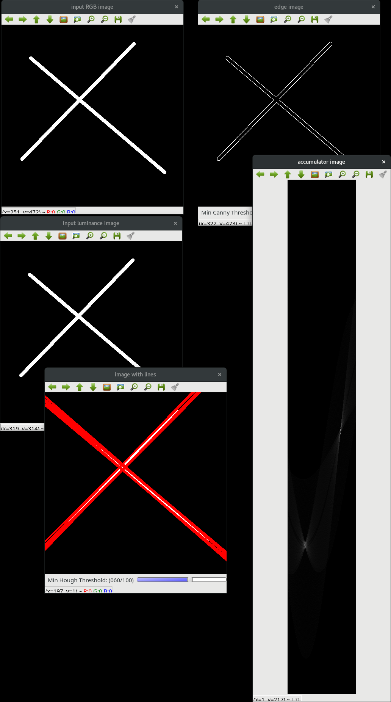

# Chapter 13 on Edge and line (and circle) detection

Content:

- `CMakeLists.txt`: Script for CMake
- `hough_transform.cxx`: Own implementation of the Hough transform
- `sobel_image.cxx`: Skeleton to implement an edge detection using the Sobel operators and a binary threshold
- `lines.png`: A test image for the Hough transform

When running `hough_transform` five windows will be created:

- The input image as a RGB image,
- The input image as a greyscale image,
- The output of a Canny operator on the greyscale image,
- The Hough transform accumulator:
    - The x-axis corresponds to *theta* from 0 to 179 degrees (the angle of the lines),
    - The y-axis corresponds to *r*, the distance of the line from the centre.
- An image showing the RGB input with red lines.

When using the program with
 `lines.png` as an argument, you will see

Copyright (c) 2020, Dr Franck P. Vidal (f.vidal@bangor.ac.uk) [http://www.fpvidal.net/](http://www.fpvidal.net/), [Module ICP-3038:
Computer Vision (20cr)](https://www.bangor.ac.uk/computer-science-and-electronic-engineering/undergraduate-modules/ICP-3038), All rights reserved.
